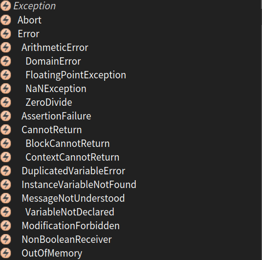
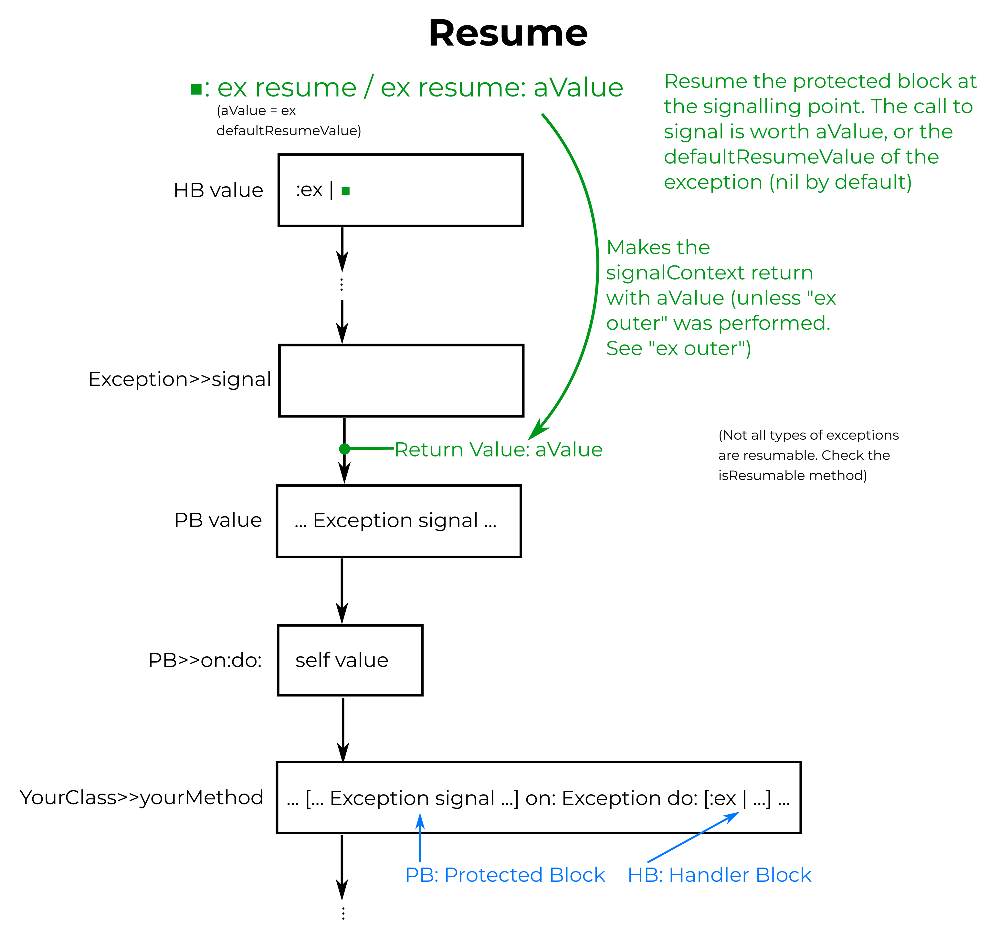
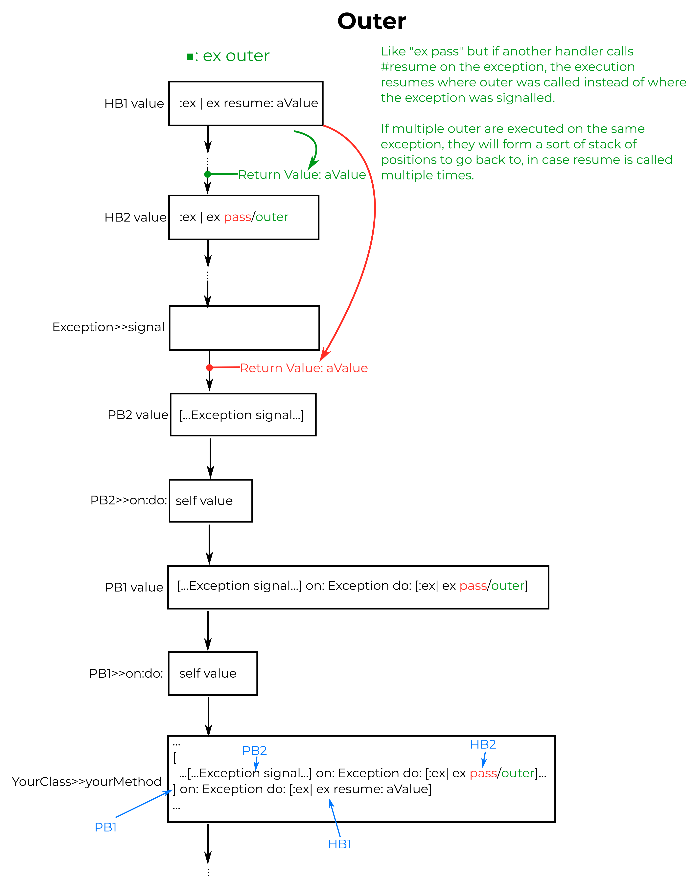
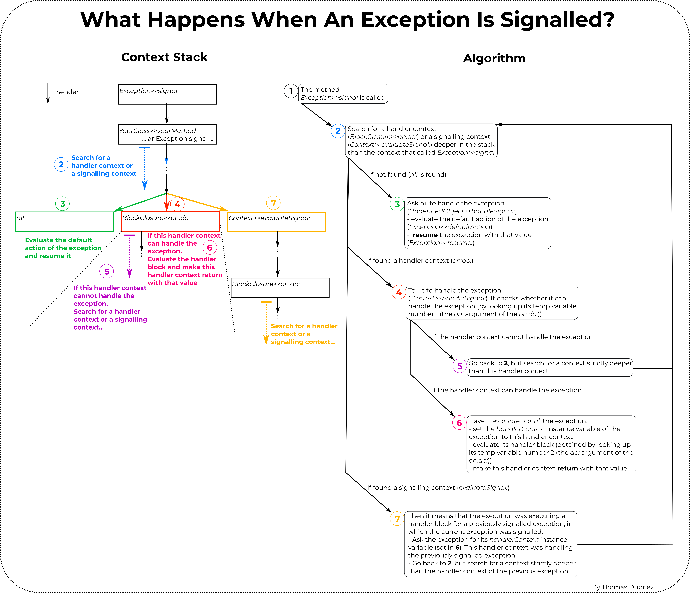

# Exceptions

All applications have to deal with exceptional situations.
Arithmetic errors may occur (such as division by zero), unexpected situations may arise (file not found), or resources may be exhausted (network down, disk full, etc.).
In languages like C, the solution is to have operations that fail return a special error code; this means that client code must check the return value of each operation, and take special action to handle errors. This leads to brittle code.

Modern programming languages, including Pharo, offer a dedicated exception-handling mechanism that greatly simplifies the way in which exceptional situations are signaled and handled.
This mechanism is the **Exception** mechanism.

- [Exceptions](#exceptions)
  * [Basic Uses](#basic-uses)
    + [Signaling an exception](#signaling-an-exception)
    + [Handling exceptions](#handling-exceptions)
    + [Creating your own exceptions](#creating-your-own-exceptions)
    + [Ensure](#ensure)
    + [IfCurtailed](#ifcurtailed)
  * [Advanced Uses](#advanced-uses)
    + [Return](#return)
    + [Retry](#retry)
    + [Resume](#resume)
    + [Pass](#pass)
    + [Outer](#outer)
    + [Resignal](#resignal)
  * [A deeper look at the exception mechanism](#a-deeper-look-at-the-exception-mechanism)
  * [Credits](#credits)

## Basic Uses

### Signalling an exception

**Syntax:**  
`anException signal`  
or:
`anException signal: 'message with additional information'`

Imagine you have a method `potentiallyProblematicMethod`, that sometimes sets a variable to a bad value. When this happens (line 3), you want to signal this problem by **signalling** an exception (in this example an `Error` exception).

```Smalltalk
potentiallyProblematicMethod
	self doThings.
	(myVariable = badValue) ifTrue: [ ^ Error new signal: 'Oh my god no!'].
	^ myVariable.
```

If you execute this code, the following window opens:


And if you click on "Debug", a debugger opens to help you understand why your application signalled an exception.


### Handling exceptions
**Syntax:**  
`protectedBlock on: anExceptionClass do: handlerBlock`.  
Handling multiple exception classes:  
`protectedBlock on: anExceptionClass, anotherExceptionClass, yetAnotherExceptionClass... do: handlerBlock`.  
Accessing the exception in the handler block:  
`protectedBlock on: anExceptionClass do: [:exceptionToHandle| yourCode]`.

As seen in the previous paragraph, if an exception is signalled and nothing else is done, a debugger opens. It is useful when developing, but in the end you probably want your application to catch these exceptions and handle them itself if possible (for example by displaying a nice pop-up informing the user of the problem). This is done with exception **handlers**.

In Pharo, an exception handler is of the form:  
`protectedBlock on: anExceptionClass do: handlerBlock`.  
Here's what happens (in English): *"Evaluate `protectedBlock`. If it signals an exception of the class `anExceptionClass`, catch this exception and evaluate `handlerBlock` instead"*.

To continue the previous example, let's say that `potentiallyProblematicMethod` is called by `solidMethod`. Now `solidMethod` is solid, so it does not want debuggers to open when it is executed. Instead, if an exception is signalled by `potentiallyProblematicMethod`, it will handle it, display a pop-up informing the user, and return `42` instead of the result of `potentiallyProblematicMethod`.

```Smalltalk
solidMethod
	^ [self potentiallyProblematicMethod]
		on: Error
		do: [UIManager default inform: 'There was an issue, but it`s ok'. 42.]
```

Now when `solidMethod` is executed, it either returns the result of `self potentiallyProblematicMethod` if no `Error` is signalled, or it displays a pop-up and returns 42 if an `Error` is signalled.


When an exception is signalled, it walks the call stack (from the current method to its caller, then the caller of the caller, etc...) until it finds a handler that can handle it. If no handler is found, a debugger is opened.

### Creating your own exceptions
`Error` is not the only kind of exception that can be signalled, there are a lot more! The following picture shows a few examples.




An issue with writing handlers for generic exception types like `Error` is that these handlers will not only handle errors your application signals (which is fine), but they will also handle errors signalled by the libraries you use, or code that your application uses but that is not a part of it. This is potentially dangerous, as your application may not be doing the right thing for these errors.

To prevent this, you can define your own types of exceptions by creating subclasses of the `Exception` class, and signal and catch these.

To continue the example, we could create an `Exception` subclass named `MyVariableHasABadValue`, and update `potentiallyProblematicMethod` and `solidMethod` as follows:

```Smalltalk
potentiallyProblematicMethod
	self doThings.
	(myVariable = badValue) ifTrue: [ ^ MyVariableHasABadValue new signal: 'Oh my god no!'].
	^ myVariable.
```

```Smalltalk
solidMethod
	^ [self potentiallyProblematicMethod]
		on: MyVariableHasABadValue
		do: [UIManager default inform: 'There was an issue, but it`s ok'. 42.]
```

### Ensure
**Syntax:**  
`aBlock ensure: ensuredBlock`.

The `ensure:` message can be sent to a block to make sure that, even if the block fails (e.g., signals an exception) the argument block will still be executed.  

This is useful to guarantee that `ensuredBlock` will be executed no matter what, for example to close files or clean up in case `aBlock` signals an exception, before the exception is transmitted.

### IfCurtailed
**Syntax:**  
`aBlock ifCurtailed: curtailBlock`

The `ifCurtailed:` message is similar to `ensure:`, but its argument block is evaluated **only** if the receiver block signals an exception.  

## Advanced Uses
After catching an exception in a handler, there are a number of advanced things you can do with the exception.

### Return
**Syntax:**  
`protectedBlock on: anExceptionClass do: [:ex | aValue ]`  
or: `protectedBlock on: anExceptionClass do: [:ex | ex return ]`  
or: `protectedBlock on: anExceptionClass do: [:ex | ex return: aValue ]`  

**Synopsis:**  
This is the standard behavior of handler blocks. If an exception is caught, this handler returns an alternative value for the protected block (the execution continues as if the protected block has returned that value).

Here is a picture of the context stack (a.k.a. call stack) explaining this operation.


### Retry
**Syntax:**  
`protectedBlock on: anExceptionClass do: [:ex | ex retry ]`  
or: `protectedBlock on: anExceptionClass do: [:ex | ex retry: aBlock ]`  

**Synopsis:**  
Re-execute the protected block (if using `#retry`), or replace the protected block with a different block and then re-execute it (if using `#retryUsing:`).

Here is a picture of the context stack (a.k.a. call stack) explaining this operation.


### Resume
**Syntax:**  
`protectedBlock on: anExceptionClass do: [:ex | ex resume ]`  
or: `protectedBlock on: anExceptionClass do: [:ex | ex resume: aValue ]` 

**Synopsis:**  
Resume the execution of the protected block just after the call to #signal. The call to #signal is worth `nil` (if using `#resume`) or `aValue` (if using `#resume: aValue`).


Here is a picture of the context stack (a.k.a. call stack) explaining this operation.


### Pass
**Syntax:**  
`protectedBlock on: anExceptionClass do: [:ex | ex pass ]`  

**Synopsis:**  
Skip the current handler and keep looking for another handler to handle this exception.


### Outer
**Syntax:**  
`protectedBlock on: anExceptionClass do: [:ex | ex outer ]`  

**Synopsis:**  
Like `ex pass`, but if another handler later calls `#resume` on the exception, the execution resumes where `#outer` was called instead of where the exception was signalled.  
If multiple `#outer` are executed on the same exception, they will form a sort of stack of positions to go back to, in case `#resume` is called multiple times on the exception.

Here is a picture of the context stack (a.k.a. call stack) explaining this operation.


### Resignal
**Syntax:**  
`protectedBlock on: anExceptionClass do: [:ex | ex resignalAs: anotherException ]`  

**Synopsis:**  
Signals `anotherException` as if it had been signalled at the same place the original exception (`ex`) was signalled.  
This can be used to catch generic exceptions and re-signal them as application-specific exceptions if they meet some criteria.

## A deeper look at the exception mechanism

The following image gives a graphical view of what happens when an exception is signalled, and the different situations that can arise.


## Credits
Parts of this page are based on the **Handling Exceptions** chapter of the [Deep Into Pharo book](http://files.pharo.org/books-pdfs/deep-into-pharo/2013-DeepIntoPharo-EN.pdf).  
Pictures by Thomas Dupriez.