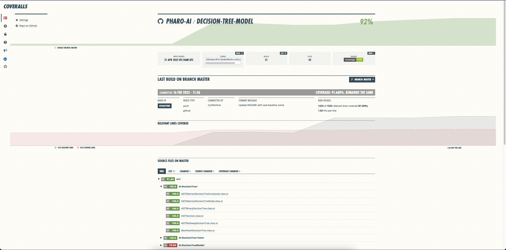
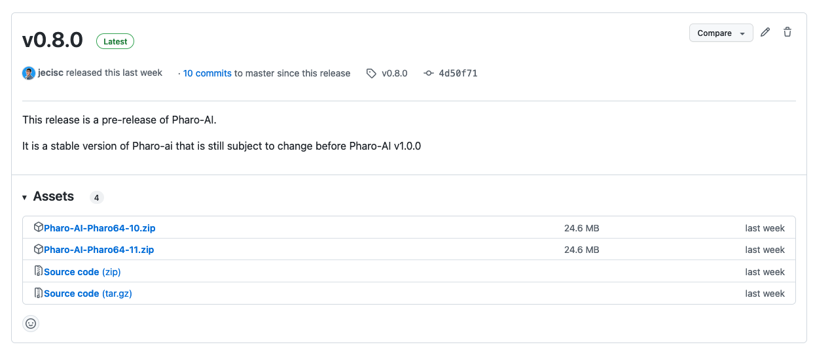

# Setting up your continuous integration via Github Actions

Previously, the Pharo community was heavily relying on Travis CI for continuous integration of projects hosted on GitHub.
But Travis becoming a pay to use service, the community created some tooling to manage the CI via Github Actions. 

This guide will get you through the process to setup your own integration.

- [Setting up your continuous integration via Github Actions](#setting-up-your-continuous-integration-via-github-actions)
  * [Simple case: Run tests on master branch](#simple-case--run-tests-on-master-branch)
  * [SmalltalkCI options](#smalltalkci-options)
    + [Load spec options](#load-spec-options)
    + [Testing options](#testing-options)
    + [Code Coverage](#code-coverage)
    + [Using custom scripts](#using-custom-scripts)
  * [Testing multiple versions of Pharo at once](#testing-multiple-versions-of-pharo-at-once)
  * [Testing on multiple OS](#testing-on-multiple-os)
  * [Manage the workflow target (branchs, PR, ...)](#manage-the-workflow-target--branchs--pr---)
    + [Target branches](#target-branches)
    + [Target pull requests](#target-pull-requests)
    + [Target releases](#target-releases)
    + [Target scheduled workflow](#target-scheduled-workflow)
    + [Other targets](#other-targets)
  * [Managing multiple workflows and SmalltalkCI configurations](#managing-multiple-workflows-and-smalltalkci-configurations)
  * [Continuous releases](#continuous-releases)
  * [Save releases artifacts](#save-releases-artifacts)
  * [Depending on resouces of your repository with GitBridge](#depending-on-resouces-of-your-repository-with-gitbridge)
  * [Add your build artifacts to PharoLauncher](#add-your-build-artifacts-to-pharolauncher)
  * [External ressources](#external-ressources)

## Simple case: Run tests on master branch

Let's start simple! This section will explain how to setup a workflow to launch the tests of the project on every commit done on master branch.

To load our Pharo project in the CI and execute the tests, we'll use [SmalltalkCI](https://github.com/hpi-swa/smalltalkCI).
This project needs a configuration file to fetch informations on your project. This file should be at the root of your project under the name of `.smalltalk.ston`. 

Here is the most simple configuration:

```ston
SmalltalkCISpec {
  #loading : [
    SCIMetacelloLoadSpec {
      #baseline : 'MyProject',
      #directory : 'src'
    }
  ]
}
```

This configuration tells smalltalkCI two things:
- The sources of the project are in /src
- The baseline to use to load the project is BaselineOfMyProject

Now that smalltalkCI configuration file is created, we just need to define your github workflow file.
This file should be located in `.github/workflows/` folder. Lets call ours `testing.yml`.

```yml
name: CI

env:
  GITHUB_TOKEN: ${{ secrets.GITHUB_TOKEN }}

on:
  push:
    branches:
      - 'master'

jobs:
  build:
    runs-on: ubuntu-latest
    steps:
      - uses: actions/checkout@v2
      - uses: hpi-swa/setup-smalltalkCI@v1
        with:
          smalltalk-image: Pharo64-10
      - run: smalltalkci -s ${{ matrix.smalltalk }}
        shell: bash
        timeout-minutes: 15
```

Let's see a little what is happening here. 

The #name parameter allows one to give a name to the workflow. This is useful because you might have more than one workflow for your project. 
For example:


In this image we can see a CI that has 3 differents workflows:
- CI
- continuous
- Release

Then we have 

```yml
on:
  push:
    branches:
      - 'master'
```

This is used to define when the workflow should enter in action. In our case, we want it when we push on master branch.

Then we have:

```yml
    runs-on: ubuntu-latest
```

With this, the workflow will run in the latest version of ubuntu

Last but not least, we have the actions to execute:

```yml
    steps:
      - uses: actions/checkout@v2
      - uses: hpi-swa/setup-smalltalkCI@v1
        with:
          smalltalk-image: Pharo64-10
      - run: smalltalkci -s ${{ matrix.smalltalk }}
        shell: bash
        timeout-minutes: 15
```

This includes 3 steps:
- Using the "checkout" action to checkout the project on the CI slave
- Setup Smalltalk CI
- Run the loading of the project and the testing with a 15min timeout

This timeout can be increased in case your project tests are longer

Once you commit this, your project have a working CI and each time you commit to master, a new build should happen.

## SmalltalkCI options

We have seen in the previous section that [SmalltalkCI](https://github.com/hpi-swa/smalltalkCI) relies on a configuration file. 
We did a simple one to start, but there are more options available. We will cover them in this section.

### Load spec options

In the previous example we declared a load spec with a baseline and a code directory. But it is also possible to add more options:

```ston
SCIMetacelloLoadSpec {
  #baseline : 'MyProject',                            // Define MC Baseline
  #directory : 'src',                                 // Path to packages
  #failOn : [ #OCUndeclaredVariableWarning ],         // Fail build on provided list of Warnings
  #ignoreImage : true,                                // If true, Metacello will force a load of a package, overriding a previously existing one
  #load : [ 'default' ],                              // Define some specific groups to load
  #onConflict : #useIncoming,                         // When there is a conflict between loaded sources and incoming sources (can be #useIncoming|#useLoaded)
  #onUpgrade : #useIncoming,                          // When loaded sources are an older version than incoming sources (can be #useIncoming|#useLoaded)
  #onWarningLog : true,                               // Log Warning messages to Transcript
  #platforms : [ #squeak, #pharo, #gemstone ],        // Define compatible platforms
  #usernameEnvVar : 'GITHUB_USER',                    // Environment variable containing the username used for authentication
  #passwordEnvVar : 'GITHUB_TOKEN',                   // Environment variable containing the password used for authentication
  #registerInIceberg : true                           // Pharo Only | Register the tested repository in Iceberg (false by default)
}
```
### Testing options
It is also possible to customize the testing of the project:

```ston
SmalltalkCISpec {
  ...
  #testing : {
    // Include specific TestCases
    #include : {
      #classes : [ #AnotherProjectTestCase ],
      #categories : [ 'AnotherProject-Tests' ],
      #packages : [ 'AnotherProject.*' ],
      #projects : [ 'BaselineOfMyProject' ]
    },

    // Exclude specific TestCases from testing
    #exclude : {
      #classes : [ #AnotherProjectTestCase ],
      #categories : [ 'AnotherProject-Tests' ],
      #packages : [ 'AnotherProject.*' ],
      #projects : [ 'ConfigurationOfMyOtherProject' ]
    },

    #allTestCases : true, // Run all TestCases in image

    // Define TestCases explicitly
    #classes : [ #MyProjectTestCase ],
    #categories : [ 'MyProject-*' ],
    #packages : [ 'MyProject.*' ],
    #projects : [ 'BaselineOfMyProject' ],

    // Other options
    #defaultTimeout : 30, // In seconds (Squeak, and Pharo 6 or later)
    #failOnSCIDeprecationWarnings : false, // Fail if a deprecated smalltalkCI API is used
    #failOnZeroTests : false, // Pass builds that did not run any tests
    #hidePassingTests : true, // Hide passing tests when printing to stdout
    #serializeError: false // (default: true) Disable serialization of failing test case (e.g. with Fuel in Pharo)
  }
}
```

### Code Coverage

It is possible to see the coverage of our project via SmalltalkCI with [Coveralls](https://coveralls.io/).

To enable this, you need to add a "coverage" section in your configuration:

```ston
SmalltalkCISpec {
  ...
  #testing : {
    ...
    #coverage : {
      #packages : [ 'SomePackage', 'SomePack*' ],
      #classes : [ #ClassToCover ],
      #categories : [ 'SomeClassCategory', 'SomeClassCat*' ],
      #format : #coveralls
    }
  }
}
```

For example our project could look like:

```ston
SmalltalkCISpec {
  #loading : [
    SCIMetacelloLoadSpec {
      #baseline : 'Myproject',
      #directory : 'src'
    }
  ],
  #testing : {
    #coverage : {
      #packages : [ 'MyProject-*' ]
    }
  }
}
```

This configuration will execute all the tests loaded by the `BaselineOfMyProject` and build the coverage of all packages starting by `MyProject-` for [Coveralls](https://coveralls.io/).
If you enabled your repository in coveralls ([https://coveralls.io/repos/new](https://coveralls.io/repos/new)), the results will be uploaded automatically.



For more informations check: [SmalltalkCI guide on coverage](https://github.com/hpi-swa/smalltalkCI/blob/master/docs/COVERAGE.md).

### Using custom scripts

SmalltalkCI offers some hooks to be able to run some Pharo scripts at different moments of the project loading and testing.
Four hooks are availables:
- `preLoading` : Executed before loading the project
- `postLoading` : Executed after loading the project
- `preTesting` : Executed before testing the project
- `postTesting` : Executed after testing the project

Those parameters can take 3 different parameters. 

The first one is a single script:

```ston
SmalltalkCISpec {
  #preLoading : 'scripts/preLoading.st',
  #loading : [
    SCIMetacelloLoadSpec {
      #baseline : 'Myproject',
      #directory : 'src'
    }
  ]
}
```

The second one is a collection of scripts:

```ston
SmalltalkCISpec {
  #loading : [
    SCIMetacelloLoadSpec {
      #baseline : 'Myproject',
      #directory : 'src'
    }
  ],
  #postLoading : [
    'scripts/postLoading1.st',
    'scripts/postLoading2.st'
  ]
}
```

And the third one is an instance of SCICustomScript that allows to run script only on certain platforms:

```ston
SmalltalkCISpec {
  #preLoading : 'scripts/preLoading.st',
  #loading : [
    SCIMetacelloLoadSpec {
      #baseline : 'Myproject',
      #directory : 'src'
    }
  ],
  #postLoading : [
    SCICustomScript {
      #path : 'scripts/postLoadingSqueak.st',
      #platforms : [ #squeak ]
    },
    SCICustomScript {
      #path : 'scripts/postLoadingPharo.st',
      #platforms : [ #pharo ]
    }
  ]
}
```

Here is a full example:

```ston
SmalltalkCISpec {
  #preLoading : 'scripts/preLoading.st',
  #loading : [
    SCIMetacelloLoadSpec {
      #baseline : 'Myproject',
      #directory : 'src'
    }
  ],
  #postLoading : [
    'scripts/postLoading1.st',
    'scripts/postLoading2.st'
  ],
  #preTesting : SCICustomScript {
    #path : 'scripts/preTesting.st',
    #platforms : [ #squeak, #pharo, #gemstone ]
  },
  #testing : ...,
  #postTesting : [
    SCICustomScript {
      #path : 'scripts/postTestingSqueak.st',
      #platforms : [ #squeak ]
    },
    SCICustomScript {
      #path : 'scripts/postTestingPharo.st',
      #platforms : [ #pharo ]
    }
  ]
}
```

For more informations on SmalltalkCI in general check: [SmalltalkCI documentation](https://github.com/hpi-swa/smalltalkCI).

## Testing multiple versions of Pharo at once

It is rare to have a project working only on one version of Pharo. Thus, it is often useful to have our workflows run on multiple versions. 

This can be archieved this way:

```yml
name: CI

env:
  GITHUB_TOKEN: ${{ secrets.GITHUB_TOKEN }}

on:
  push:
    branches:
      - 'master'

jobs:
  build:
    runs-on: ubuntu-latest
    strategy:
      matrix:
        smalltalk: [ Pharo64-9.0, Pharo64-10, Pharo64-11 ]
    name: ${{ matrix.smalltalk }}
    steps:
      - uses: actions/checkout@v2
      - uses: hpi-swa/setup-smalltalkCI@v1
        with:
          smalltalk-image: ${{ matrix.smalltalk }}
      - run: smalltalkci -s ${{ matrix.smalltalk }}
        shell: bash
        timeout-minutes: 15
```

Here we declared a matrix with multiple versions of Pharo as axes:

```yml
    strategy:
      matrix:
        smalltalk: [ Pharo64-9.0, Pharo64-10, Pharo64-11 ]
```

Each axe will use the name of the Pharo version as name:

```yml
    name: ${{ matrix.smalltalk }}
```

But this could also be another name such as:

```yml
    name: MyProject-${{ matrix.smalltalk }}
```

Then the builds would be: `MyProject-Pharo64-9.0`, `MyProject-Pharo64-10` and `MyProject-Pharo64-11`.

The names will then be used to display the different builds on Github:


The list of possible Pharo versions are:

| 64bits           | 32bits           |
| ---------------- | ---------------- |
| `Pharo64-alpha`  | `Pharo32-alpha`  |
| `Pharo64-stable` | `Pharo32-stable` |
| `Pharo64-11`     | `Pharo32-11`     |
| `Pharo64-10`     | `Pharo32-10`     |
| `Pharo64-9.0`    | `Pharo32-9.0`    |
| `Pharo64-8.0`    | `Pharo32-8.0`    |
| `Pharo64-7.0`    | `Pharo32-7.0`    |
| `Pharo64-6.1`    | `Pharo32-6.1`    |
| `Pharo64-6.0`    | `Pharo32-6.0`    |
|                  | `Pharo32-5.0`    |
|                  | `Pharo32-4.0`    |
|                  | `Pharo32-3.0`    |

> Note: This list is from February 2023. More versions will be added in the future

## Testing on multiple OS

Usually, our Pharo project are not influence by the OS on whitch it runs. But in some cases, it can be important to test on multiple OS.

This can be archieved this way: 

```yml
name: CI

env:
  GITHUB_TOKEN: ${{ secrets.GITHUB_TOKEN }}

on:
  push:
    branches:
      - 'master'

jobs:
  build:
    strategy:
      matrix:
        os: [ macos-latest, windows-latest, ubuntu-latest]
        smalltalk: [ Pharo64-9.0, Pharo64-10]
    runs-on: ${{ matrix.os }}
    name: ${{ matrix.smalltalk }} on ${{ matrix.os }}
    steps:
      - uses: actions/checkout@v2
      - uses: hpi-swa/setup-smalltalkCI@v1
        with:
          smalltalk-image: ${{ matrix.smalltalk }}
      - run: smalltalkci -s ${{ matrix.smalltalk }}
        shell: bash
        timeout-minutes: 15
```

As we can see here:

```yml
        os: [ macos-latest, windows-latest, ubuntu-latest]
    runs-on: ${{ matrix.os }}
```

We declare that our project will be run on the latest macos, windows and ubuntu to covers the 3 major OS. 

To distinguish the builds, we use the Pharo version and the OS name to name our builds:

```yml
    name: ${{ matrix.smalltalk }} on ${{ matrix.os }}
```


You can find more information on the available OS here: [https://docs.github.com/en/actions/using-github-hosted-runners/about-github-hosted-runners](https://docs.github.com/en/actions/using-github-hosted-runners/about-github-hosted-runners)

## Manage the workflow target (branchs, PR, ...)

In our simple example at the beginning, we were launching the CI on the master branch, but it is not the only option.

### Target branches

It is possible to target multiple branches at once. For example:

```yml
on:
  push:
    branches:
      - 'master'
      - 'development'
      - 'feature/**
```

This will launch your workflow for every commit on `master`, `development` or any branch starting by `feature/`. 

You can also target all branches doing:

```yml
on:
  push:
    branches:
      - '**'
```

And in case you want to execute it on all branches except some you can use:

```yml
on:
  push:
    branches:
      - '**'
      - '!doc/**'
```

This templace will launch the CI for every commit on any branch except the ones starting by `doc/`.

### Target pull requests

It is also possible to target PR made to your project like this:

```yml
on:
  pull_request:
    types: [assigned, opened, synchronize, reopened]
```

Note that this can be done in addition of other targets:

```yml
on:
  push:
    branches:
      - '**'
      - '!master'
  pull_request:
    types: [assigned, opened, synchronize, reopened]
```

Here the workflow runs on every pull requests and every commit of any branch except `master`.

### Target releases

It is also sometimes useful to have a workflow targeting releases. We'll exploit that later in this documentation.
In that case you can use:

```yml
on:
  release:
    types: [created, edited]
```

### Target scheduled workflow

In some cases, it might be useful to target the workflow on specific times. 
For example, it happens that some projects are "meta project". Their goal is to load a bunch of other project. In that case, it's rare that a commit is made direcly in them.
But we want to run the CI on a regular basis to be sure our project still works. In that case we can use a cron to schedule the workflow:

```yml
on:
  push:
    branches:
      - 'master'
  schedule:
    - cron:  '0 0 * * *'
```

Some utils will help you to configure the parameter of this target such as [Crontab.guru](https://crontab.guru/).

### Other targets

Github actions have way more options that the options presented here. The most useful ones were presented here, but you can find more information in [Github documentation](https://docs.github.com/en/actions/using-workflows/workflow-syntax-for-github-actions#on)

## Managing multiple workflows and SmalltalkCI configurations

Until now, we managed only one workflow file, but it is possible to manage multiple of them.

To demonstrate this, let's imagine that our project has two groups in his configuration.
A first group loads the core of the project and is the default group of our baseline. 
A second group loads the full projets with additional features. 

We would now like to have two workflows:
- A first workflow launched on all branches and PR to test the core in Pharo 9, 10 and 11
- A second workflow launched on master branch and PR to test the full project in Pharo 11

The first step is to get two smalltalkCI configuration.

A first one will be the default `.smalltalk.ston`.

```ston
SmalltalkCISpec {
  #loading : [
    SCIMetacelloLoadSpec {
      #baseline : 'MyProject',
      #directory : 'src'
    }
  ]
}
```

And a second one loads the group `all` and is named `.smalltalkFull.ston`.

```ston
SmalltalkCISpec {
  #loading : [
    SCIMetacelloLoadSpec {
      #baseline : 'MyProject',
      #directory : 'src',
      #load : [ 'all' ]
    }
  ]
}
```

Now that we have our two configurations, we can create our two workflow files. 

The first one is close to what we have seen until here in this documentation:

```yml
name: CI Core

env:
  GITHUB_TOKEN: ${{ secrets.GITHUB_TOKEN }}

on:
  push:
    branches:
      - '**'
  pull_request:
    types: [assigned, opened, synchronize, reopened]

jobs:
  build:
    runs-on: ubuntu-latest
    strategy:
      matrix:
        smalltalk: [ Pharo64-9.0, Pharo64-10, Pharo64-11 ]
    name: ${{ matrix.smalltalk }}
    steps:
      - uses: actions/checkout@v2
      - uses: hpi-swa/setup-smalltalkCI@v1
        with:
          smalltalk-image: ${{ matrix.smalltalk }}
      - run: smalltalkci -s ${{ matrix.smalltalk }}
        shell: bash
        timeout-minutes: 15
```

In the second we will change the targets and we will give one more parameter to the smalltalkCI launch command to specify the path to our specific smalltalk configuration.

```yml
name: CI Full

env:
  GITHUB_TOKEN: ${{ secrets.GITHUB_TOKEN }}

on:
  push:
    branches:
      - 'master'
  pull_request:
    types: [assigned, opened, synchronize, reopened]

jobs:
  build:
    runs-on: ubuntu-latest
    name: ${{ matrix.smalltalk }}
    steps:
      - uses: actions/checkout@v2
      - uses: hpi-swa/setup-smalltalkCI@v1
        with:
          smalltalk-image: Pharo64-11
      - run: smalltalkci -s ${{ matrix.smalltalk }} .smalltalkFull.ston
        shell: bash
        timeout-minutes: 15
```

We can see in those file that we have two different names to be able to identify which workflow is running. 
And we notice the new parameter in the SmalltalkCi command:

```yml
      - run: smalltalkci -s ${{ matrix.smalltalk }} .smalltalkFull.ston
        shell: bash
        timeout-minutes: 15
```

> Note: If we wanted to run on the same targets with two smalltalkCI configuration, we could also have used another matrix axis to avoid the need of two workflows

Having multiple workflows can have other usage that we will exlpore in the next sections

## Continuous releases

Until now, we are using Github actions to test our project. But it is not the only thing we can do here. 
We could also save the result of some builds to be able to download them and use them with our project directly setup.

In this section, we will see how to save the result of the builds of our master branch in a github release.

To do that, we can first remove the master branch from the targets of our test workflow becaure we will handle the master branch in another workflow.

```yml
on:
  push:
    branches:
      - '**'
      - '!master'
  pull_request:
    types: [assigned, opened, synchronize, reopened]
```

Then we will create another workflow called `.github/workflows/continuous.yml`.

```yml
name: continuous

env:
  GITHUB_TOKEN: ${{ secrets.GITHUB_TOKEN }}

on:
  push:
    branches:
      - 'master'

jobs:
  build:
    runs-on: ubuntu-latest
    env:
      PROJECT_NAME: MyProject-${{ matrix.smalltalk }}
    strategy:
      matrix:
        smalltalk: [ Pharo64-10, Pharo64-11 ]
    name: ${{ matrix.smalltalk }}
    steps:
      - uses: actions/checkout@v2
      - uses: hpi-swa/setup-smalltalkCI@v1
        with:
          smalltalk-version: ${{ matrix.smalltalk }}
      - run: smalltalkci -s ${{ matrix.smalltalk }}
        shell: bash
        timeout-minutes: 15
        
      # Here we zip the result of the build to be able to keep the artefacts
      - name: package
        run: |
          mv /home/runner/.smalltalkCI/_builds/* .
          mv TravisCI.image $PROJECT_NAME.image
          mv TravisCI.changes $PROJECT_NAME.changes
          echo ${${{ matrix.smalltalk }}} | sed -e 's/.*\-//g ; s/\..*//g ; s/$/0/' > pharo.version
          zip -r $PROJECT_NAME.zip $PROJECT_NAME.image $PROJECT_NAME.changes *.sources pharo.version
          ls
        
      #Save the artefact of the build under "continuous" tag
      - name: Update release
        uses: johnwbyrd/update-release@v1.0.0
        with:
          release: 'continuous'
          token: ${{ secrets.GITHUB_TOKEN }}
          files: ${{ env.PROJECT_NAME }}.zip
```

This workflow starts like what we have seen until now. It checkout our project, install smalltalkCI and runs it. 
But it also adds three steps to the process. 

The first step is to give a name to our project. We will use that name to name our build artifact:

```yml
    env:
      PROJECT_NAME: MyProject-${{ matrix.smalltalk }}
```

In the second step, we rename the image produced by SmalltalkCI. We generate a version file that is useful in tools such as the `PharoLauncher`. And we zip the files in the archive to save.

```yml
      # Here we zip the result of the build to be able to keep the artefacts
      - name: package
        run: |
          mv /home/runner/.smalltalkCI/_builds/* .
          mv TravisCI.image $PROJECT_NAME.image
          mv TravisCI.changes $PROJECT_NAME.changes
          echo ${${{ matrix.smalltalk }}} | sed -e 's/.*\-//g ; s/\..*//g ; s/$/0/' > pharo.version
          zip -r $PROJECT_NAME.zip $PROJECT_NAME.image $PROJECT_NAME.changes *.sources pharo.version
          ls
```

The last step is to publish the artifact in the continuous tag. For that we are using the action `johnwbyrd/update-release@v1.0.0`.

```yml
      #Save the artefact of the build under "continuous" tag
      - name: Update release
        uses: johnwbyrd/update-release@v1.0.0
        with:
          release: 'continuous'
          token: ${{ secrets.GITHUB_TOKEN }}
          files: ${{ env.PROJECT_NAME }}.zip
```

> Note: The name of the continuous release can be changed

Once this is done, each commit on master will result on updating the assets of the `contunious` release on github to save the latest one.


## Save releases artifacts

We have seen how to save the last artifact of a branch in a `continuous` release, but another case needs to be taken into account: the real releases.

It is useful when we release a project to save a Pharo image of this project with the version of the release.

This can be done with a new workflow file that will target realeses:

```yml
name: Release

env:
  GITHUB_TOKEN: ${{ secrets.GITHUB_TOKEN }}

on:
  release:
    types: [created, edited]

jobs:
  build:
    runs-on: ubuntu-latest
    env:
      PROJECT_NAME: MyProject-${{ matrix.smalltalk }}
    strategy:
      matrix:
        smalltalk: [ Pharo64-10, Pharo64-11 ]
    name: ${{ matrix.smalltalk }}
    steps:
      - uses: actions/checkout@v2
      - uses: hpi-swa/setup-smalltalkCI@v1
        with:
          smalltalk-version: ${{ matrix.smalltalk }}
      - run: smalltalkci -s ${{ matrix.smalltalk }}
        shell: bash
        timeout-minutes: 15
        
      # Here we zip the result of the build to be able to keep the artefacts
      - name: package
        run: |
          mv /home/runner/.smalltalkCI/_builds/* .
          mv TravisCI.image $PROJECT_NAME.image
          mv TravisCI.changes $PROJECT_NAME.changes
          echo ${${{ matrix.smalltalk }}} | sed -e 's/.*\-//g ; s/\..*//g ; s/$/0/' > pharo.version
          zip -r $PROJECT_NAME.zip $PROJECT_NAME.image $PROJECT_NAME.changes *.sources pharo.version
          ls
        
      - name: Release
        uses: softprops/action-gh-release@v1
        with:
          files: ${{ env.PROJECT_NAME }}.zip
```

This file looks a lot like the one we wrote in the previous section.

I few changes are to be noted. The is the name of the workflow to identify it easily in the Actions tab of Github.
The second is the target to build only on releases.

```yml
on:
  release:
    types: [created, edited]
```

And the last change is the action used after creating our Pharo archive.

```yml
      - name: Release
        uses: softprops/action-gh-release@v1
        with:
          files: ${{ env.PROJECT_NAME }}.zip
```

This action will add the files matching the $files: property to the assets of the release.



## Depending on resouces of your repository with GitBridge

It happens in some project that we need resources to do some tests. In the past, it was common to save those resources as a string or a byte array directly in a method of the project.
This makes can have multiple drawbacks like making the management of the project harder, droping Pharo's performances in code management, no real versionning of those resources…

Now that we can store our projects on git, an alternative is possible: Save your resources in your git repository and use file references in Pharo to access them.

To help with that, the project [GitBridge](https://github.com/jecisc/GitBridge) was created. 
This project helps one to access resources from the git repository and informations from git directly from the Pharo image.

This project can be added as a dependency of your project with this spec:

```Smalltalk
    spec
    	baseline: 'GitBridge'
    	with: [ spec repository: 'github://jecisc/GitBridge:v1.x.x/src' ]
```

In order to create a GitBridge to your project, you first need to subclass `GitBridge` and to store your bridge in a package of your project.

```Smalltalk
GitBridge subclass: #MyProjectBridge
	slots: {  }
	classVariables: {  }
	package: 'MyProject'
```

This new bridge needs a class initialization like this one:

```Smalltalk
MyProjectBridge class>>initialize
	SessionManager default registerSystemClassNamed: self name
```

This will allow the bridge to reset some cache at the image startup.

Now that your bridge is created, if it finds an Iceberg repository, associated to its local clone, containing the package in which the bridge is defined, you will be able to use the bridge to access some resources.

For example you can get a file reference to the git folder like this:

```Smalltalk
MyProjectBridge root
```

And this allows you to access your test resouces.

Once your project is using `GitBridge`, you just need to be sure of two things in order for the CI to work. 
The first is to have the option `#registerInIceberg` to true in your smalltalkCI configuration.

```ston
SmalltalkCISpec {
  #loading : [
    SCIMetacelloLoadSpec {
      #baseline : 'MyProject',
      #directory : 'src',
      #registerInIceberg : true
    }
  ]
}
```

And the second is to add a parameter to the checkout action of your workflow file in order to fetch the full history of git:

```yml
  steps:
    - uses: actions/checkout@v3
      with:
        fetch-depth: '0'
```

Once those steps are setup, your tests should be able to run and fetch resources from your git repository without trouble.
For more information you can look at the [documentation of GitBridge](https://github.com/jecisc/GitBridge).

## Add your build artifacts to PharoLauncher

[Pharo launcher](https://pharo-project.github.io/pharo-launcher//) is a great tool to manage Pharo images and here we are going to explain how to be able to get images of your project from it. 

> Note: In order to do this, you will need to have a continuous release and/or a release workflow setup as we explained earlier in this documentation.

Pharo launcher comes with a default set of sources to fetch Pharo images. It also allows one to add its own sources, and we will show here how to add your project as one of your own source.

It is doable thanks to the `mysources.list` of pharo-launcher file located in the `PhLUserTemplateSources sourcesFile` folder. If present, this file defines additional template sources beyond the official list of templates. At this time, there is no UI to add them.

To find the right folder:

* Open the Pharo Launcher
* Open a Playground (Ctrl + O, Ctrl + W)
* Execute `PhLUserTemplateSources sourcesFile`

You can now edit `mysources.list` in this folder to add the images of your project you wish to have in your Pharo launcher.

Here is how to add images from your continuous release:

```st
[
	PhLTemplateSource {
		#type : #URLGroup,
		#name : 'MyProject',
		#templates : [
			PhLTemplateSource {
				#type : #URL,
				#name : 'MyProject Pharo 10 - master',
				#url : 'https://github.com/MY_USERNAME/MY_PROJET_NAME/releases/download/continuous/MyProject-Pharo64-10.zip'
			},
			PhLTemplateSource {
				#type : #URL,
				#name : 'MyProject 11 - master',
				#url : 'https://github.com/MY_USERNAME/MY_PROJET_NAME/releases/download/continuous/MyProject-Pharo64-11.zip'
			}
		]
	}
]
```

And here is how to add images from a specific release, lets say `v1.4.3`:

```st
[
	PhLTemplateSource {
		#type : #URLGroup,
		#name : 'MyProject',
		#templates : [
			PhLTemplateSource {
				#type : #URL,
				#name : 'MyProject Pharo 10 - v1.4.3',
				#url : 'https://github.com/MY_USERNAME/MY_PROJET_NAME/releases/download/v1.4.3/MyProject-Pharo64-10.zip'
			},
			PhLTemplateSource {
				#type : #URL,
				#name : 'MyProject Pharo 11 - v1.4.3',
				#url : 'https://github.com/MY_USERNAME/MY_PROJET_NAME/releases/download/v1.4.3/MyProject-Pharo64-11.zip'
			}
		]
	}
]
```

You can then adapt those sources to what you need. Once it is done, you can click on the `New` button of the launcher and see a new source named `MyProject`.

## External ressources

Here are some resources on github actions and Pharo:
- [https://badetitou.fr/misc/2020/11/30/Testing-pharo-with-github-actions/](https://badetitou.fr/misc/2020/11/30/Testing-pharo-with-github-actions/)
- [https://badetitou.fr/misc/2022/10/27/test-your-moose-code-using-ci/](https://badetitou.fr/misc/2022/10/27/test-your-moose-code-using-ci/)
- [https://modularmoose.org/2021/07/19/automatic-metamodel-documentation-generation.html](https://modularmoose.org/2021/07/19/automatic-metamodel-documentation-generation.html)

Do not hesitate to do a PR to add more resources ;)