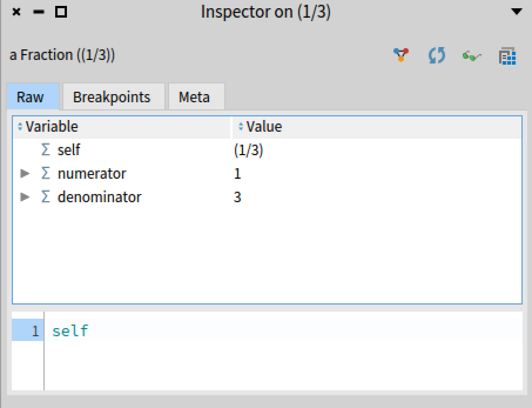
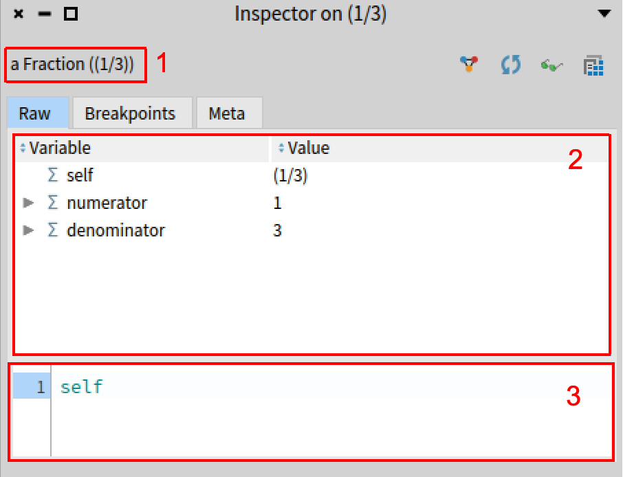
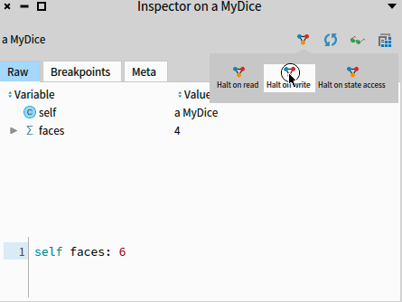
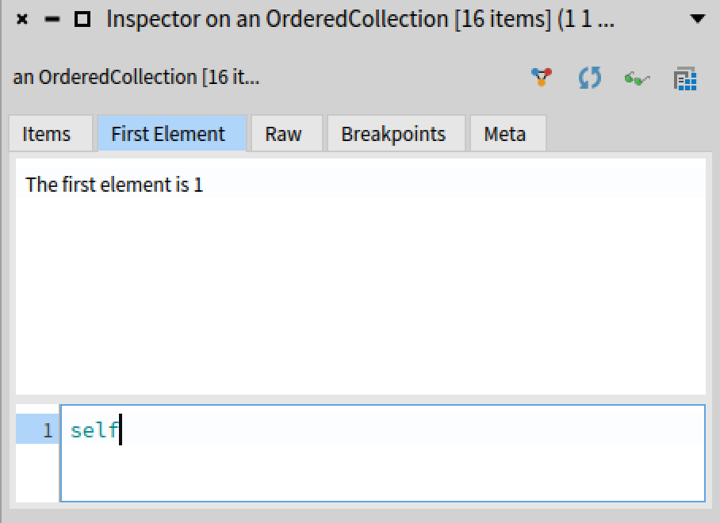
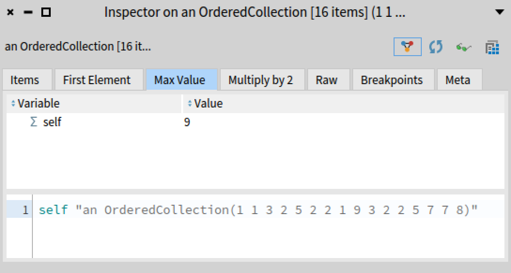
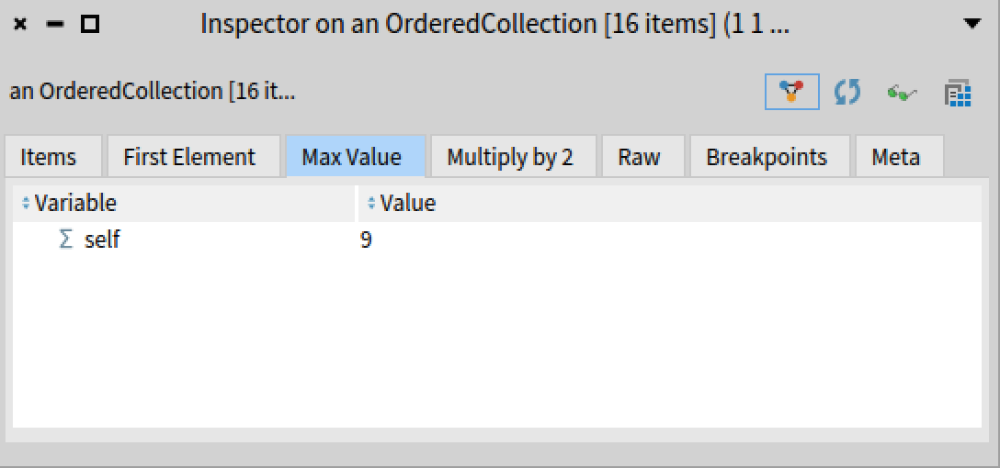

# Inspector

*Written based on Pharo 12.0.0 - Build information: Pharo-12.0.0+build.710.sha9e02d19b14a8ecb9cbd45d6ba0166d3b92202c3c (64 Bit)*

The Inspector is a tool that is used to look at an object. In Pharo, inspecting an object means opening this tool. It allows to navigate the object structure and look at the state of the variables, but can show other information.

You can inspect the result of an execution by selecting the code and using the shortcut`Cmd/ctrl + i` or `right-clic + "Do & inspect it"`. This will execute the code and open an inspector on the result. 


The  [🐥 Learn Keyboard Shortcuts \[W1-Live D\]](https://www.youtube.com/watch?v=7YTsys2qxMU&list=PL2okA_2qDJ-kCHVcNXdO5wsUZJCY31zwf&index=10&t=133s) video from the [Pharo MOOC](https://mooc.pharo.org/) demonstrate how to open it.

By inspecting `1/3` we get the following inspector :




## A first look at the inspector



The tree framed areas in the next pictures are :
1. This text starts with the **class** of the inspected object. Here we have an instance of Fraction.
2. This is the raw view object. It shows the internal state of the object. Here the fraction as a `numerator` instance variable holding the value 1, and a `denominator` instance variable holding the value 3. 

This is a tree list. When you see the small grey triangle on the left side, by clicking it you can unfold the state of the object inside the instance variable. 
By clicking on an instance variable you can also open a new inspector pane.

This is recursive : if you click on more variables, more pane will open. By default only the last two panes are visible at any time. You can use the small rectangles at the bottom of the window to navigate in the opened pane. You can also choose how many panes and showing at the same times and which one. 

Here is a small demonstration :


3. This last area is the evaluator. In this area you can write expression and evaluate them like you would do it in the playground. In a given evaluator, `self` is referring to the inspected object. This can be seen in the raw view above the evaluator showing the value of the `self` variable.

## The pane tool bar

Each inspector pane has the following toolbar :


- The **last button** allows one to open a browser on the class of the inspected object. It can be used to check for available methods to use in the evaluator
- The **green glasses** button opens another inspector window on the current object
- The **circling arrows** button allow to refresh the crurent view of the object. Fields of an object are not updated live, so if the object is modified from elsewhere, the new values will only show if the refresh button is used.
- The **triangle button** is related to object-centric debugging. It allows one to put breakpoints on state access (read and/or write) of a specific object.The following animation shows how to put a breakpoint on writing an instance variable, the `Breakpoints` tab listing breakpoints on the current object and how to deactivate one :



## The Meta tab : searching for methods and class hierarchy
The `Meta` tab is the last one that is available on most objects.
On the left it shows the class hierarchy of the current object's class and on the right the methods available. Clicking on parent classes in the hierarchy will show methods implemented in this class on the right. Selecting a method will display its source code at the bottom of the tab.


## Creating custom tabs

If you used the inspector a bit, you might have noticed that some objects have additional tabs showing up in the inspector.
For example both Floats and Integer have their first tabs showing different representations of the numbers :


Another example is the `FileReference` class. When a file reference is inspected, according to the type of the file, different tab show up with relevant information.

Creating a new tab requires being able to build UI elements called presenters with spec 2. For more explanation on how to build a spec 2 presenters, please see the [Spec 2 documentation](https://github.com/SquareBracketAssociates/BuildingApplicationWithSpec2/tree/master).

For people building visualisation, [Roassal 3](https://github.com/ObjectProfile/Roassal3) visualisations can be embedded in a spec 2 presenter by sending the `asPresenter` message to an instance of RSCanvas.

The following sections will explain how to add a few additional tabs to instances of `OrderedCollection`. This class already as a custom tab showing the list of its items which is defined by its superclass `Collection`.

### Adding a tab with text

Let's add a first tab containing a text describing the first element of the collection. Define the following method :

```Smalltalk
OrderedCollection << inspectionFirstElement

	<inspectorPresentationOrder: 1 title: 'First Element'>

	^ SpTextPresenter new text: 'The first element is ', self first asString; beNotEditable; yourself
```
`<inspectorPresentationOrder: 1 title: 'First Element'>` is a pragma that is detected when creating an inspector on an object. When creating an inspector on an instance of `OrderedCollection`, this method will now be used to generate a tab. The title of the tab will be `First Element`, it will be in position 1 in the order of tabs.

The content of the tab is returned by the method. Here we are creating a text presenter with the content we want and we specify it should not be editable.

This gives us the following result :


We notice that our new tab is in second position. This is because in `Collection<<inspectionItems:` (the method defining the Items tab) the order parameter is 0.

### Adding a tab with a table and conditions on when to display it

Let's create a new tab that will display a table only when the collection contains only numbers. It will show each number and the results of 2 times that number.

First let's create the tab with the table:
```Smalltalk
OrderedCollection << inspectionMultipliedByTwo

	<inspectorPresentationOrder: 10 title: 'Multiply by 2'>
	| presenter |
	presenter := SpTablePresenter new
		             addColumn:
			             ((SpStringTableColumn
				               title: 'Item'
				               evaluated: #yourself)
				              width: 30;
				              yourself);
		             addColumn: (SpStringTableColumn
				              title: 'Multiply by 2'
				              evaluated: [ :each | each * 2 ]);
		             items: self;
		             beResizable;
		             yourself.
	^ presenter
```
If we inspect a collection of numbers we get the following tab :


However if the collection contains elements that are not numbers, the tab crashes and looks like a red rectangle. By defining a method with the name `<name of the method defining the tab>Context:` we can specify when we want to activate a given tab.
For example :
```Smalltalk
OrderedCollection << containsOnlyNumbers 
	^ self allSatisfy: [ :each | each isNumber  ]


OrderedCollection << inspectionMultipliedByTwoContext: aContext
	^ aContext active: self containsOnlyNumbers.
```
Will ensure that the tab will be displayed only when there is only number in the collection.


## Adding a raw view of a specific element of the collection and removing the evaluator

We can also add a tab showing the raw view of the max value :
```Smalltalk
OrderedCollection << inspectionIMaxValue
	<inspectorPresentationOrder: 5 title: 'Max Value'>
	^ StRawInspectionPresenter on: self max.

OrderedCollection << inspectionIMaxValueContext: aContext
	^ aContext active: self containsOnlyIntegers.
```


However as we can see above, the self in the evaluator does not match the self in the max value which is confusing so we will hide the evaluator.

```Smalltalk
OrderedCollection << inspectionIMaxValueContext: aContext
	aContext withoutEvaluator.
	^ aContext active: self containsOnlyIntegers.
```
By reinspecting the same collection we get :


### How to add Roassal charts ?
As said above, Roassal, allow one to build visualisations.
The library includes some common graphs like the histogram for example.
Let's add a histogram of the values if there are only numbers in the collection :

```Smalltalk

OrderedCollection << inspectionIntegerHistogram

	<inspectorPresentationOrder: -1 title: 'Histogram'>
	| plot |
	plot := RSHistogramPlot new x: self.
	^ plot asPresenter


OrderedCollection << inspectionIntegerHistogramContext: aContext 

	aContext active: self containsOnlyIntegers.
	aContext withoutEvaluator.
```
By inspecting `{ 1 . 1 . 3 . 2 . 5 . 2. 2 . 1. 9. 3 . 2. 2. 5 . 7 . 7 . 8  } asOrderedCollection` we get :


