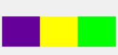
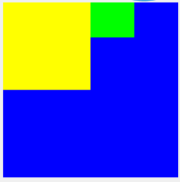
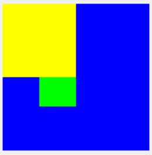
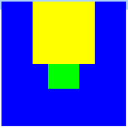
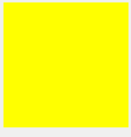
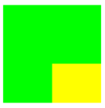
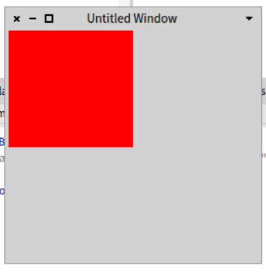
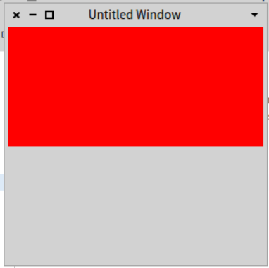

# Layout

## Row layout :

This layout display the submorphs of a morph horizontally aligned.
By default, the submorphs display start at the topLeft corner of the morph.
With this layout, the submorphs was display in a array. This array associate a submorph with a cell of the array.
The size of a cell in Y depends of the max size of the morph in Y. However, the length in X of a cell depends of the size of the submorph who are display in this cell.
We modify the display of the submorph with several attribut :
-	cellPositioning
-	cellInset
-	extent
- hResizing
- vResizing

cellPositioning takes several values : center, bottomLeft, bottomRight, topLeft, topRight. This value allow to modify the display of the submorphs.
cellInset : set a space between each cell of the morph, it takes an integer.
extent : set the size of the morph, it takes a point.
hResizing: allow to modify a morph horizontally. It takes several value : shrinkWrap, spaceFill, rigid.
        - rigid allow to not modify the morph
        - shrinkWrap resize the morph to fit the frame of his submorph.
        - spaceFill fill the empty space with this morph
vResizing: allow to modify a morph vertically. and it takes the same value as hResizing.

Example 1 : Row layout with two morph


```
| m1 m2 m3|
m1 := Morph new layoutPolicy: RowLayout new; yourself.
m2 := Morph new color: Color green.
m3 := Morph new color: Color yellow.
m1 addMorph: m2.
m1 addMorph: m3.
m1 openInWorld.`
```
Example 2 : Row layout with three morph


```
| m1 m2 m3 m4|
m1 := Morph new layoutPolicy: RowLayout new; yourself.
m2 := Morph new color: Color green.
m3 := Morph new color: Color yellow.
m4 := Morph new color: Color purple.
m1 addMorph: m2.
m1 addMorph: m3.
m1 addMorph: m4.
m1 openInWorld.
```
Example 3 : Row layout with two morph with cellPositioning : bottomLeft


```
| m1 m2 m3|
m1 := Morph new color: Color blue; layoutPolicy: RowLayout new;extent: (200@200);cellPositioning: #bottomLeft; yourself.
m2 := Morph new color: Color green.
m3 := Morph new color: Color yellow; extent: (100@100); yourself.
m1 addMorph: m2.
m1 addMorph: m3.
m1 openInWorld .
```
Example 4 : Row layout with two morph with cellPositioning : center


```
|m1 m2 m3|
m1 := Morph new color: Color blue; layoutPolicy: RowLayout new; extent: (200@200); cellPositioning: #center; yourself.
m2 := Morph new color: Color green.
m3 := Morph new color: Color yellow; extent: (100@100); yourself.
m1 addMorph: m2.
m1 addMorph: m3.
m1 openInWorld .
```

Exemple 5 : Row layout example with two morph with cellPositioning = topLeft


```
|m1 m2 m3|
m1 := Morph new color: Color blue; layoutPolicy: RowLayout new; extent: (200@200); cellPositioning: #topLeft; yourself.
m2 := Morph new color: Color green.
m3 := Morph new color: Color yellow; extent: (100@100); yourself.
m1 addMorph: m2.
m1 addMorph: m3.
m1 openInWorld .
```

Exemple 6 : Row layout with hResizing and vResizing at = spaceFill


```
| m1 m2 m3|
m1 := Morph new layoutPolicy: RowLayout new; yourself.
m1 extent: 250@250.
m2 := Morph new color: Color green.
m3 := Morph new color: Color purple.
m2 vResizing: #spaceFill.
m2 hResizing: #spaceFill.
m3 extent: 100@100.
m1 addMorph: m2.
m1 addMorph: m3.
m1 openInWorld.
```

Exemple 7 : Row layout with hResizing and vResizing at = shrinkWrap


```
| m1 m2 m3|
m1 := Morph new layoutPolicy: RowLayout new; yourself.
m1 vResizing: #shrinkWrap.
m1 hResizing: #shrinkWrap.
m1 extent: 250@250.
m2 := Morph new color: Color green.
m3 := Morph new color: Color purple.

m3 extent: 100@100.
m1 addMorph: m2.
m1 addMorph: m3.
m1 openInWorld.
```

## Table Layout :

The layout process:
For computing the new layout for the children of any morph, we start with an initial rectangle which is provided as a reference.

Step 1: The first step of layout computation is to compute the minimum extent each of our children can have. The minimum extent is mapped through both the local layout frame of the morph (for relative positioning) and the global layout frame (for insets, such as cursor indication) to obtain the minimal size required for each cell.

Step 2: Based on the cell sizes, the number of cells we can put into each row and column is computed. For equal spacing, the maximum size of the cells is taken into account here.

Step 3: Based on the row/column sizes, we compute the extra space which should be added to each row/column. For
#leftFlush/#topFlush - we add all extra space add the end
#rightFlush/#bottomFlush - we add all extra space at the start
#centering - we add 1/2 of the extra space at start and end
#justified - we distribute the space evenly between the morphs
[NOTE: If any #spaceFill morphs are encountered during this step, #justified is implied and the space is exclusively and equally distributed between those #spaceFill morphs. This is for backward compatibility and should *never* be necessary in the new regime].

Step 4: The morphs are placed in the computed cells and the extra space is distributed as necessary. Placing the submorphs is done by mapping through the global and the local layout frame as requested.

Start point:
=> bounds: new rectangle for the morph.

Compute basic arrangement of morphs:
=> For each submorph compute minExtent
- if global layout frame inset in global layout frame
- if local layout frame inset in local layout frame
=> Compute number of morphs per, width and height of row/column
- if equal spacing based on max size
=> Compute extra space per row/column
- if centering = #justified; distribute space equally
- if centering #leftFlush/#topFlush (-1) add start extra
- if centering #rightFlush/#bottomFlush (1) add end extra
- if centering #centered add 1/2 extra to start/end
<extra space must be float and rounded accordingly!>
=> Place morphs in appropriate cells
- if global layout frame inset in global layout frame
- if local layout frame inset in local layout frame
<will likely cause #layoutChanged by submorphs>

Distribute morphs in row/column:

=> Compute the max length of each row/column

Example 1 : Table layout with two morph


```
|m1 m2 m3|
m1 := Morph new layoutPolicy: TableLayout new; yourself.
m2 := Morph new color: Color green.
m3 := Morph new color: Color yellow.
m1 addMorph: m2.
m1 addMorph: m3.
m1 openInWorld.
```

Example 2 : Table layout with three morph


```
|m1 m2 m3 m4|
m1 := Morph new layoutPolicy: TableLayout new; yourself.
m2 := Morph new color: Color green.
m3 := Morph new color: Color yellow.
m4 := Morph new color: Color purple.
m1 addMorph: m2.
m1 addMorph: m3.
m1 addMorph: m4.
m1 openInWorld.
```

Exemple 3 : Table layout with two morph with cellPositioning : center


```
|m1 m2 m3|
m1 := Morph new color: Color blue; layoutPolicy: TableLayout new; extent: (200@200); cellPositioning: #center; yourself.
m2 := Morph new color: Color green.
m3 := Morph new color: Color yellow; extent:  (100@100); yourself.
m1 addMorph: m2.
m1 addMorph: m3.
m1 openInWorld.
```

Exemple 4 : Table layout with two morph with cellPositioning = topLeft


```
|m1 m2 m3|
m1 := Morph new color: Color blue; layoutPolicy: TableLayout new; extent: (200@200); cellPositioning: #topRight; yourself.
m2 := Morph new color: Color green.
m3 := Morph new color: Color yellow; extent: (100@100); yourself.
m1 addMorph: m2.
m1 addMorph: m3.
m1 openInWorld.
```

Exemple 5 : Table layout with two morph with cellPositioning = topRight


```
|m1 m2 m3|
m1 := Morph new color: Color blue; layoutPolicy: TableLayout new; extent: (200@200); cellPositioning: #topLeft; yourself.
m2 :=  Morph new color: Color green.
m3 := Morph new color: Color yellow; extent: (100@100); yourself.
m1 addMorph: m2.
m1 addMorph: m3.
m1 openInWorld.
```

Exemple 6 : Table layout with vResizing and hResizing = shrinkWrap.


```
| m1 m2 m3 m4|
m1 := Morph new layoutPolicy: TableLayout new; yourself.
m1 vResizing: #shrinkWrap.
m1 hResizing: #shrinkWrap.
m1 extent: 1500@1500.
m2 := Morph new color: Color green.
m3 := Morph new color: Color yellow.
m4 := Morph new color: Color purple.
m4 extent: 100@100.
m1 addMorph: m2.
m1 addMorph: m3.
m1 addMorph: m4.
m1 openInWorld.
```

Exemple 7 : Table layout with vResizing and hResizing = spaceFill


```
| m1 m2 m3|
m1 := Morph new layoutPolicy: TableLayout new; yourself.
m1 extent: 250@250.
m2 := Morph new color: Color green.
m3 := Morph new color: Color purple.
m2 vResizing: #spaceFill.
m2 hResizing: #spaceFill.
m3 extent: 100@100.
m1 addMorph: m2.
m1 addMorph: m3.
m1 openInWorld.
```

Exemple 8 : Table layout with wrapCentering = center


```
| m1 m2 m3 |
m1 := Morph new layoutPolicy: TableLayout new; yourself.
m2 := Morph new color: Color green.
m3 := Morph new color: Color yellow; layoutPolicy: TableLayout new; yourself.
m1 extent: 200@200.
m1 wrapCentering: #center.
m1 addMorph: m2.
m3 extent: (100@100).
m1 addMorph: m3.
m1 openInWorld.
```

Exemple 9 : Table layout with wrapCentering = bottomRight


```
| m1 m2 m3 |
m1 := Morph new layoutPolicy: TableLayout new; yourself.
m2 := Morph new color: Color green.
m3 := Morph new color: Color yellow; layoutPolicy: TableLayout new; yourself.
m1 extent: 200@200.
m1 wrapCentering: #bottomRight.
m1 addMorph: m2.
m3 extent: (100@100).
m1 addMorph: m3.
m1 openInWorld.
```

Exemple 10 : Table layout with wrapCentering = topLeft


```
| m1 m2 m3 |
m1 := Morph new layoutPolicy: TableLayout new; yourself.
m2 := Morph new color: Color green.
m3 := Morph new color: Color yellow; layoutPolicy: TableLayout new; yourself.
m1 extent: 200@200.
m1 wrapCentering: #topLeft.
m1 addMorph: m2.
m3 extent: (100@100).
m1 addMorph: m3.
m1 openInWorld.
```

## Stack Layout :

Unstack the submorphs at the center of the morph in default.
It could be a problem if the last submorph unstack was bigger than the other submorph, because the last one was display on the other.
It takes several attribut but the most relevant attribut was :
-	cellPositioning
-	extent
cellPositioning set the point of reference to display morph. For example, if the value was center, the morphs were gonna display with the center, if the value was : topRight, they gonna stack on the top right corner of parent morph

Example 1 : Stack layout with two morph with lower morph extent


 ```
|m1 m2 m3|
m1 := Morph new layoutPolicy: StackLayout new; yourself.
m2 :=  Morph new color: Color green; extent: (100@100); yourself.
m3 := Morph new color: Color yellow .
m1 addMorph: m2.
m1 addMorph: m3.
m1 openInWorld.
```

Example 2 : Stack layout with two morph with upper morph extent


 ```
|m1 m2 m3|
m1 := Morph new layoutPolicy: StackLayout new ; yourself.
m2 :=  Morph new color: Color green.
m3 := Morph new color: Color yellow; extent: (100@100); yourself .
m1 addMorph: m2.
m1 addMorph: m3.
m1 openInWorld.
 ```
Exemple 3 : Stack layout with two morph with cellPositioning = topRight


```
|m1 m2 m3|
m1 := Morph new layoutPolicy: StackLayout new; cellPositioning: #topRight; yourself.
m2 :=  Morph new color: Color green; extent: (100@100); yourself.
m3 := Morph new color: Color yellow .
m1 addMorph: m2.
m1 addMorph: m3.
m1 openInWorld.  
```

Exemple 4 :  Stack layout with two morph with cellPositioning = bottomRight


```
|m1 m2 m3|
m1 := Morph new layoutPolicy: StackLayout new; cellPositioning: #bottomRight; yourself.
m2 :=  Morph new color: Color green; extent: (100@100); yourself.
m3 := Morph new color: Color yellow .
m1 addMorph: m2.
m1 addMorph: m3.
m1 openInWorld.
 ```

## Proportionnal layout :

Allow to modify the relative size of a submorph when the size of the container change.
The goal was to change proportionnaly to the size of the morph.
For doing this, the submorph need a frame where he will be display.
This frame was a percentage of the morph.
For example: if we give a frame of (0 @ 0 corner: 0.5 @ 0.5) to a submorph, he occupy 25% of the morph.
And if we resize the container, the size of the submorph will be resize proportionaly to stay with a occupy frame of 25%.

exemple 1 : Proportionnal layout with 25% of the morph area.


```
|frame sub|
m1 :=SystemWindow new.
m1 layoutPolicy: ProportionalLayout new.
frame := (0 @ 0 corner: 0.5 @ 0.5) asLayoutFrame .
sub := Morph new color: Color red.
m1 addMorph: sub fullFrame: frame.
m1 extent:300@300.
m1 openInWorld.
```
Exemple 2 : Proportionnal layout with 50% of the morph area.


```
|frame sub|
m1 :=SystemWindow new.
m1 layoutPolicy: ProportionalLayout new.
frame := (0 @ 0 corner: 1.0 @ 0.5) asLayoutFrame .
sub := Morph new color: Color red.
m1 addMorph: sub fullFrame: frame.
m1 extent:300@300.
m1 openInWorld.
```
Example 3 : Proportionnal layout with 100% of the morph area.


```
|frame sub|
m1 :=SystemWindow new.
m1 layoutPolicy: ProportionalLayout new.
frame := (0 @ 0 corner: 1.0 @ 1.0) asLayoutFrame .
sub := Morph new color: Color red.
m1 addMorph: sub fullFrame: frame.
m1 extent:300@300.
m1 openInWorld.
```
Example 4 : Proportionnal layout with 2 Morph, each Morph was display on 50% of the morph area.


```
|frame sub|
m1 := SystemWindow new.
m1 layoutPolicy: ProportionalLayout new.
frame := (0 @ 0 corner: 1.0 @ 1.0) asLayoutFrame .
sub := Morph new layoutPolicy: TableLayout new.
m3 := Morph new color: Color green; yourself.
m2 := Morph new color: Color red; yourself.
sub addMorph: m2 fullFrame: frame.
sub addMorph: m3 fullFrame: frame.
m1 addMorph: sub fullFrame: frame.
m1 extent: 300@300.
m1 openInWorld.
```

Example 5: Proportional layout with scrollbar


```
| window scrollPane pasteUpMorph |
	window := Morph new layoutPolicy: ProportionalLayout new.
	window extent: (500@500).
	scrollPane := ScrollPane new.
	pasteUpMorph := Morph new color: Color yellow .
	pasteUpMorph extent: 1000@1000.
	scrollPane scroller addMorph: pasteUpMorph.
	window addMorph: scrollPane fullFrame: (0@0 corner: 1@1).

	window openInWorld.
```

## Annexe :

No minimal size in particular
