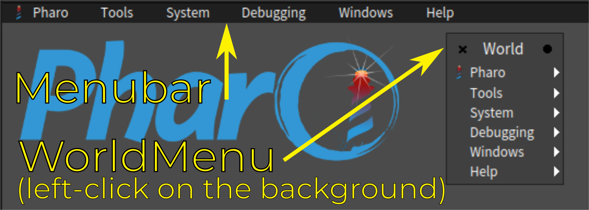

# Menubar and World menu

In Pharo, to open tools or execute actions a Menubar (At the top of the screen) and a WorldMenu (Appears on a left click in the world) are present.

This page will document some aspects of those features. 

- [Disable the Menubar/WorldMenu](#disable-the-menubarworldmenu)
- [Add your own entries](#add-your-own-entries)
  * [Add a simple entry](#add-a-simple-entry)
  * [Add a sub menu](#add-a-sub-menu)
- [Change the menu](#change-the-menu)



## Disable the Menubar/WorldMenu

In some case, we want to hide the menubar and/or the world menu. For example, when releasing a new version of a project to deploy, the development tools need to be hidden. 

It is possible to do that with some settings.

**Disable Menubar**

This option is named `Show menubar` in the setting browser and is equivalent of executing:

```Smalltalk
MenubarMorph showMenubar: false
```

**Disable the WorldMenu**

It is not possible to disable this feature alone (without disabling the Menubar) in Pharo <= 7. 

In Pharo 8 it is possible to disable the WorldMenu alone with the setting named `Show world menu` or by executing:

```Smalltalk
PasteUpMorph shouldShowWorldMenu: false
```

**Disable WorldMenu and Menubar**

To disable both the menubar and the world menu it is possible to disable each of them individually, or to change the setting `World menu pragma` to set an empty pragma. Programmatically, it can be done this way:

```Smalltalk
WorldState desktopMenuPragmaKeyword: ''
```

## Add your own entries

It is possible to add entries to the world menu and menu bar.

To build the menu, Pharo uses a pragma mecanism. Each class method containing a pragma `<worldMenu>` will be executed with a menu builder as parameter. The method should then configure the builder to add the needed entries.

### Add a simple entry

To add a simple entry, one need to create and configure a new item in the builder.

Here is a minimal example of a new entry toogling the `Show deprecation warnings` setting:

```Smalltalk
MyClass class>>toggleDeprecationWorldMenuOn: aBuilder
	<worldMenu>
	(aBuilder item: #ToggleDeprecation)
		action: [ Deprecation raiseWarning: (Deprecation raiseWarning) not ]
```

Then multiple things can be configured. 

- `order:` : Takes a number as parameter and sort the entries with those values from the minimal to the maximal value.
- `help:` : Takes a string as parameter and display at is a tooltip on a long mouse over the menu entry.
- `iconName:` : Takes a symbol as parameter and display an icon correspongding to the name next to the menu entry. (See [this page for more infos](CoolSnippets.md#browse-all-available-icons))
- `icon:` : Takes a `Form` as parameter and use it to display next to the menu entry.
- `label:` : Takes a string as parameter and replace the display text of the menu entry from the item name to the string.
- `action:` : Takes a block as parameter and execute it when the entry is clicked.
- `withSeparatorAfter` : Add a separator in the UI after this entry.

```Smalltalk
toggleDeprecationWorldMenuOn: aBuilder
	<worldMenu>
	(aBuilder item: #ToggleDeprecation)
		order: 10;
		help: 'Toggle the show deprecation setting';
		iconName: #tools;
		label: 'Toggle deprecation';
		action: [ Deprecation raiseWarning: (Deprecation raiseWarning) not ];
		withSeparatorAfter
```

### Add a sub menu

It is possible to have submenus in the Menubar. This can be achieve in two ways. 

The first way is to create a new menu and add the children in a `#with:` block.

Example:

```Smalltalk
extensionsWorldMenuOn: aBuilder
	<worldMenu>
	(aBuilder item: #Extensions)
		order: 5;
		iconName: #add;
		with: [ (aBuilder item: #ToggleDeprecation)
				order: 10;
				help: 'Toggle the show deprecation setting';
				iconName: #tools;
				label: 'Toggle deprecation';
				action: [ Deprecation raiseWarning: Deprecation raiseWarning not ];
				withSeparatorAfter ]
```

The second way is to define the submenus in a different place and to use the `#parent:` method to link it to its menu.

Example:

```Smalltalk
extensionsWorldMenuOn: aBuilder
	<worldMenu>
	(aBuilder item: #Extensions)
		order: 5;
		iconName: #add
```

```Smalltalk
toggleDeprecationWorldMenuOn: aBuilder
	<worldMenu>
	(aBuilder item: #ToggleDeprecation)
		parent: #Extensions;
		order: 10;
		help: 'Toggle the show deprecation setting';
		iconName: #tools;
		label: 'Toggle deprecation';
		action: [ Deprecation raiseWarning: Deprecation raiseWarning not ];
		withSeparatorAfter
```

## Change the menu

It is also possible to totally change the Menubar and WorldMenu in case you do not like the current one, or if you want to create a menu for your application. 

In order to do so, you need to define your own pragma to use by executing this code:

```Smalltalk
WorldState desktopMenuPragmaKeyword: 'myOwnMenu'
```

Then you can follow the previous section replacing the `<worldMenu>` pragma by `<myOwnMenu>` in the examples.
