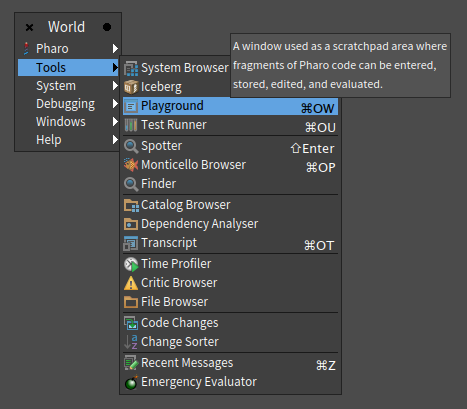
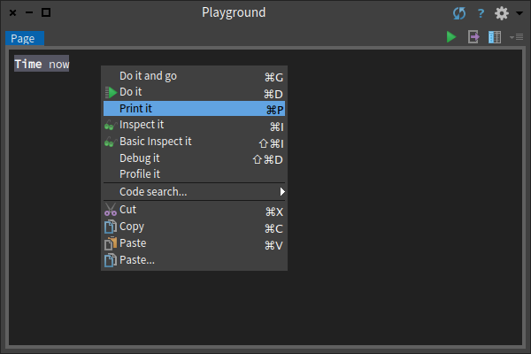
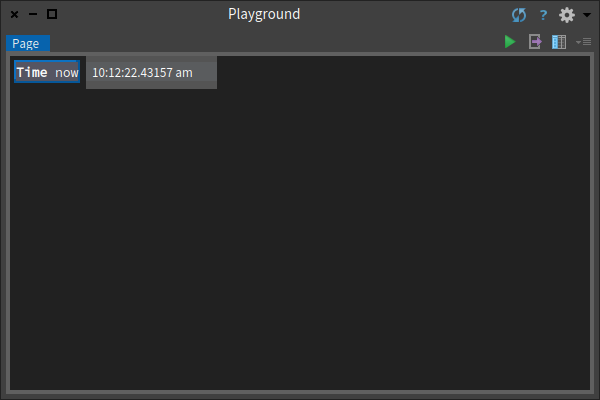
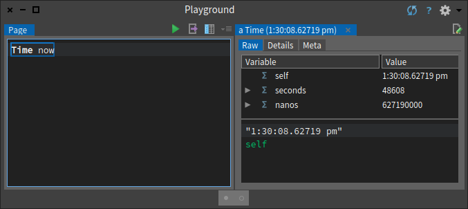
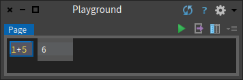

# Playground

- [Basic usage](#basic-usage)
  * [Do it](#do-it)
  * [Print it](#print-it)
  * [Do it and go](#do-it-and-go)
  * [Inspect it](#inspect-it)
  * [Basic inspect it](#basic-inspect-it)
  * [Debug it](#debug-it)
  * [Profile it](#profile-it)
  * [Code search](#code-search)
- [Some Advices](#some-advices)
  * [Doing vs. Printing](#doing-vs-printing)
- [Advance usage](#advance-usage)
  * [Variables bindings](#variables-bindings)
  * [Remote publishing](#remote-publishing)
  * [Get back previous playground contents](#get-back-previous-playground-contents)
  * [Give a name to a playground to get it back](#give-a-name-to-a-playground-to-get-it-back)
  * [Sharing playgrounds content in multiple local images](#sharing-playgrounds-content-in-multiple-local-images)


Playground is a tool that is most often used for typing Pharo expressions and executing them but it can be used as a scratchpad area where fragments of Pharo code can be entered, stored, edited, and evaluated.

You can open it with the shortcut `cmd/ctrl + o + w` or using the menu entry from the menubar: 



## Basic usage
The Playground can be used to quickly execute Pharo code. You write something and then can do operations on the code, such as:

### Do it 
Shortcut: `cmd/ctrl + d` It Executes the code/expression


### Print it
Shortcut: `cmd/ctrl + p` It Compiles the expression, executes it, sends the message `printString` to the result, and displays the resulting string.




### Do it and go
Shortcut: `cmd/ctrl + g` It executes the code and additionally opens a navigable inspector on the side of the playground. It allows us to navigate the object structure.



### Inspect it
Shortcut: `cmd/ctrl + i` It executes the code and additionally opens a navigable inspector outside of the playground. It allows us to navigate the object structure.


> The title tells us that `11:55:11.561177 am` is an instance of the class `Time`. The top panel allows us to browse the instance variables of an object and their values. The bottom panel can be used to write expressions to send messages to the object. 

### Basic inspect it
Shortcut: `cmd/ctrl + shift + i` It opens a minimal inspector on the result of the expression. (Might be useful if you work on the Inspector for example)
### Debug it
Shortcut: `cmd/ctrl + shift + d` It opens a debugger on the code with the context at the start of the snippet.


>The Debugger is a tool that not only lets you inspect the run-time stack of your program when an error is raised, but it also enables you to interact with all of the objects of your application, including the source code. In many cases you can modify your source code from the debugger and continue executing. The debugger is especially effective as a tool to support test-first development in tandem with SUnit.

### Profile it
Profiles the code with the Pharo profile tool which shows how much time is spent for each message sent.
### Code search
Offers several options provided by System Browser, such as browsing the source code of an expression, searching for senders and implementors, and so on.

You can also use the playground for typing any text that you would like to remember, such as to-do lists or instructions for anyone who will use your image.


## Some Advices
### Doing vs. Printing
The diference between this two actions is visual. try to execute something like `1+5` with `Do it`. Maybe you think that nothing happened because there isn't a visual cue about the execution but in fact something did happen. You sent the message `+` with argument `5` to the number `1`.

Now try to do it with Print it, the same will happen but also you will see the result printed just aside:



That could be useful if you want to understand the result value.

## Advance usage

In this section, we will cover some advance usages of the Playground. 


The previous figure highlight different parts of the playground we will refer to in this explanation.

1. The playground name tab
2. The run button
3. The remote publishing button
4. The bindings table
5. The pages history

Out of those, the simplest feature is the run button that will just execute the content of the playground and open an embedded inspector in the playground with the result of the expression. It is the equivalent of `Do it and go` (cmd/ctrl + g).

### Variables bindings

The playground is able to manage variables in two way. The first way is the classic Smalltalk way of declaring temporary variables (`| varName |`) at the beginning of the playground and using them later. 

Example:

```Smalltalk
| result |
result := 1 + 2.
result := result + 3.
```

Using this kind of variables will work as the temporary variables of methods. During the execution they will be initialized at nil, they will be used during the current execution and then they will be discarded. 

> Note: If you select a piece of code to execute it, do not forget to select the temporary variables declaration line.

The second way to manage variables in the playground is to use them without declaring them. 

Example:

```Smalltalk
result := 1 + 2.
result := result + 3
```

By doing so, during its first use, the playground creates and initialize the new variable to nil and stores it. This means that the variable will still exist and will still contain its value after the execution. If you execute the previous piece of code in a playground and then select `result` to inspect it, you will find the value `6`.

This feature is useful while playing with some code. For example, if you need to work on a model, instead of recreating the model at each run you can just initialize it one time and reuse the variable containing the model for all the playground session.

If at some point you don't remember the content of some variables, you can find all the variables the playground bound in the binding table button (4 on the previous overview screenshot). 

### Remote publishing

In case you want to share some code with someone, the Playground includes a remote publishing service. 

By clicking the button 3 from the overview screenshot previously displayed, you will publish the content of your playground on the cloud and get a link to it. 

You can then share this link and everyone with it will be able to see the content of your playground.

### Get back previous playground contents

When working the playground will once in a while save the code of your playground in a local file. Using those saved files you have the possibility to open a new playground containing the code of a previously closed playground. 

In order to get back a previous playground, you need to open a new playground and use button 5 from the overview, the *page history button*. You will see the start of the code from your previous playgrounds and you need to double click on the one you want to get back.

### Give a name to a playground to get it back

Another feature of the playground is the ability to give a name to a playground in order to get its content back easily once closed.

In order to name a playground, you need to double click the page name (1 on the overview screenshot) and type the name of your choice. Once this is done, the playground will save this name locally. 

If you close the playground and want to get it back, you can open a `Spotter` (`shift + enter`) and type the name of the closed playground. In the list of results of the spotter, you should find a section named `Playground named pages` containing the name of your playground. By selecting this entry, a new playground with the code of your named playground will open.

### Sharing playgrounds content in multiple local images

One last feature to highlight is the ability to share playground code between multiple local Pharo images.

We have seen in the previous sections that it is possible to get back the content of the previous playgrounds via the `page history button` and the ability of the Spotter to find previous named playground pages. By updating some settings of the playground, it is possible to share that history through all your images.

As explained before, when using the playground and naming playgrounds, the content is stored in local files. In order to share the playgrounds through different images, they need to use the same folders to store their content. Two settings are available for that and can be found in the setting browser under `Tools` -> `Glamourous Toolkit`. 


The two interesting settings are:

- `Local Playground cache directory`: this setting allows one to choose a specific folder to store the unnamed playground contents.
- `Local Playground stash directory`: this setting allows one to choose a specific folder to store the named playground contents.

Sharing this setting with multiple images will allow one to share playgrounds history through all those images.