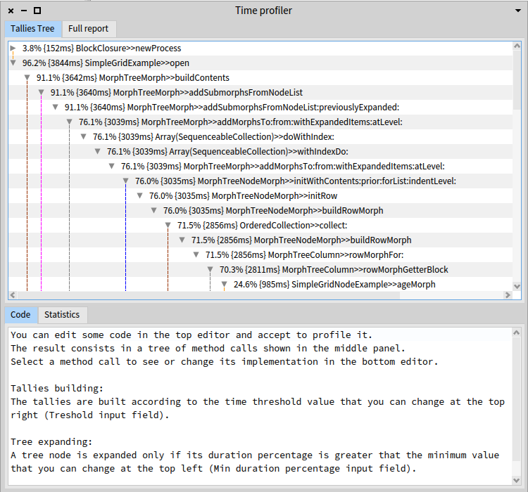
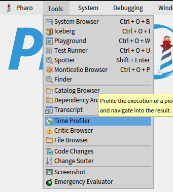
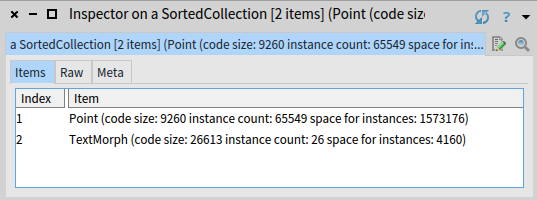

# Profiling
Profiling a program is the act of measuring, for example, the time or space it takes to execute.

- [Time Profiling](#time-profiling)
  * [Programmatically open a Time Profiler](#programmatically-open-a-time-profiler)
  * [Utility methods on blocks to profile](#utility-methods-on-blocks-to-profile)
  * [Interactively open a Time Profiler](#interactively-open-a-time-profiler)
- [Virtual Machine Execution Time Profiling](#virtual-machine-execution-time-profiling)
- [Space Profiling](#space-profiling)

## Time Profiling
### Programmatically open a Time Profiler
If `SimpleGridExample new open` is the program you want to profile, run:
```Smalltalk
TimeProfiler spyOn: [ SimpleGridExample new open ]
```
Result: a breakdown of the methods in which the program spent time.



> If your block execution time is too fast (~ < 3ms), the time profiler will not display any result.

The time profiler UI is composed of multiple parts:
- *Tallies tree* displays a tree of all the nested method calls of the execution with the percentage of time spent in each call. The tree stops at primitive calls or calls that are too fast to be benchmarked (~ < 3ms)
- *Code* displays the code of the selected method in the `tallies tree`
- *Statistics* displays memory and garbage collection statistics. Those informations may be useful if too much execution time is spent in the full or incremental garbage collection. This may signal that the code executed create too many temporary objects. The code can then be reviewed to create less copies or temporary objects. If it is not possible, consider changing the parameter of the VM to do less garbage collection during the execution of some algorithms.
- *Full report* displays textual informations such as the tallies tree and statistics, but also informations on leaf methods where most of the time is spent. (Section `**Leaves**`) This can be a good source of information to find bottlenecks where the time is spent.

### Utility methods on blocks to profile
If `SimpleGridExample new open` is the program you want to profile, **inspect** or **print**:

```Smalltalk
[ SimpleGridExample new open ] bench.
```

Result: the number of times the profiler was able to run the program per second.


You can also check the execution time of a set of instructions by inspecting or printing the result of the `timeToRun` method on blocks like this:

```Smalltalk
[ SimpleGridExample new open ] timeToRun
```

### Interactively open a Time Profiler
You can access a UI for the time profiler tool via the menu bar.



Result: type your code in the top box and click "Profile it".


## Virtual Machine Execution Time Profiling
> TODO

## Space Profiling
Imagine you want to know how much instances of the classes Point and TextMorph there are in the system, and how much space they occupy. **Inspect**:
```Smalltalk
((SpaceTally new spaceTally: (Array with: TextMorph with: Point)) 
	asSortedCollection: [:a :b | a spaceForInstances > b spaceForInstances])
```
Result:


