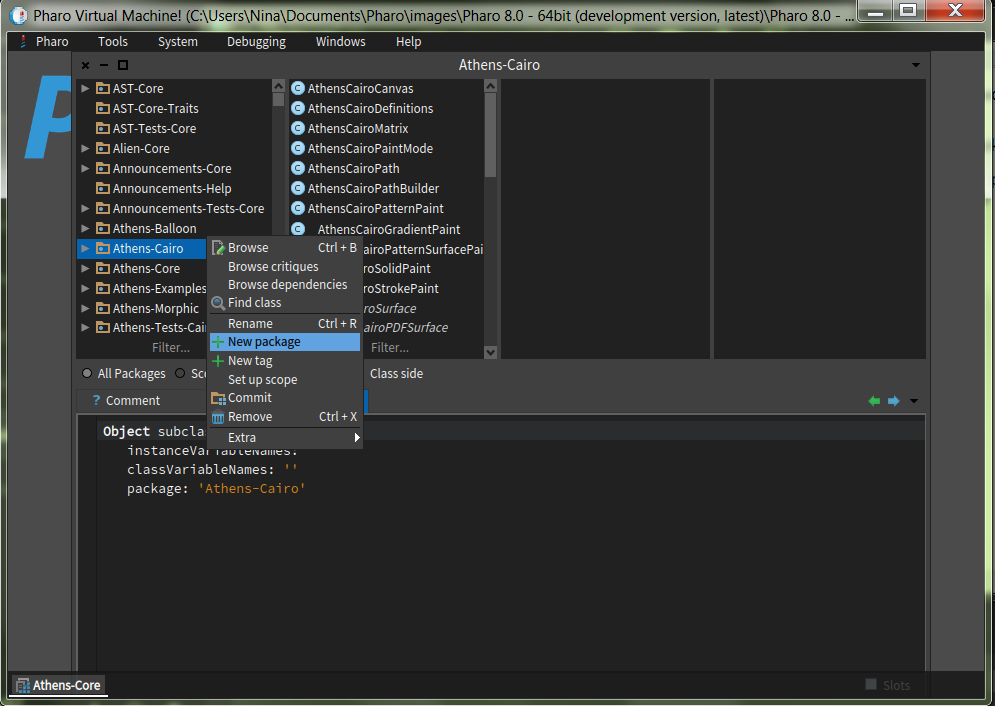

# Setting up a new project

In this article, I will describe the workflow I use for setting up a new project in Pharo. I will guide you through the whole process from getting a new Pharo image, creating the GitHub repository, and setting up the CI.

## Step 0. Download and install Pharo Launcher

In order to work with Pharo, you should dowload and install Pharo Launcher - a tool for managing Pharo images. It is available for Windows, Linux, and macOS in both 32bit and 64bit version and can be dowloaded from [http://pharo.org/download]().

## Step 1. Get a fresh Pharo image

Instructions in this tutorial were written for Pharo 8, 64bit. But they should also work fine for Pharo 7. I suggest that you start your new project with the latest development version of Pharo.

Open your Pharo Launcher. You will see two panels:

- **New Image Templetes** on the left - here you can select a template of a new image that you want to create on your machine.
- **Current Images** on the right - created images will appear here. By double-clicking on image name, you can launch it.

Open the list of `Official distributions` in the left panel and double-click on the latest development version of Pharo. In my case, this is `Pharo 8.0 - 64bit (development version, latest)`. Give a nice descriptive name to your new image and press `OK`. You can now find your image in the right panel. Launch it by double-clicking on the image name.

## Step 2. Create a package and a class

Let us make our first package. In your newly made image in Pharo Launcher, look at the menu on the top. Choose a tools card and from there open System Browser.

System Browser is split into five parts. The most left one, shows all the packages that already exist. To create a new one, press the right click of a mouse on this part, and choose the option New Package. 

Choosing it, a new small window will open, where you give a name to the package you are creating.

We will show this by following an example. The task is to make a small library of mathematical functions.Type the name *TinyMathLibrary* in Window for creating a new package and press ok.

To create a class, first you need to choose the package in which it will be located. Then look at the bottom part of the System Browser in it there is a template for creating a class. It gives us all the information we need: superclass, variables, package. Creating a new class is as easy as filling out this template. Continuing with our example, we will create a new class *MathFunctions*. The superclass is *Object*, so we will not change that. But we will change the name of the class. You will notice that saving our class, the second left part of SystemBrowser is no longer empty.

## Step 3. Write some tests

## Step 4. Create repository on GitHub

## Step 5. Load the repository into your image

## Step 6. Add your package and do the first commit

## Step 7. Create a baseline and a Metacello script

## Step 8. Set up the continuous integration (CI)

## Step 9. Add badges to your README.md
