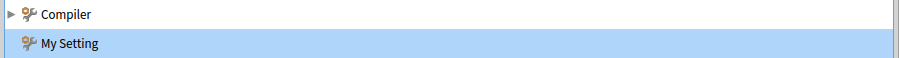
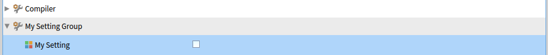
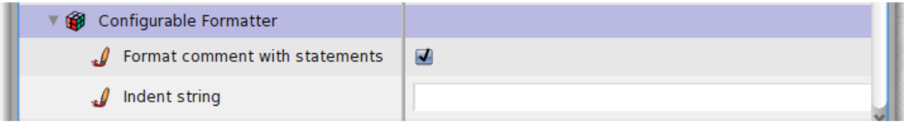
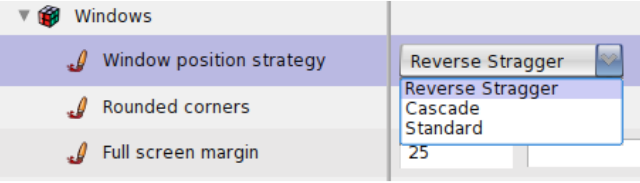

# Settings

A Pharo developer can define **settings** to give users a way to easily customise... well, anything really.
The advantages of using the settings framework of Pharo are:
- Users can change the value of any setting defined in the image with the **Settings Browser** window. No need to build a custom UI for it.
- It is easy to add settings to an already existing application. A setting is basically just a class variable (or an instance variable of a singleton object) whose value can be set from the Settings Browser.
- No dependency. Your application does not depend on the **Pharo Settings Framework**, and the Pharo Settings Framework does not depend on your application.

## Table of Contents

* [The Settings Browser](#the-settings-browser)
* [Declaring a Setting](#declaring-a-setting)
	+ [As quick as possible](#as-quick-as-possible)
	+ [WARNING!: Default value of a setting](#warning-default-value-of-a-setting)
	+ [Elements of a Setting Declaration](#elements-of-a-setting-declaration)
		- [Id of the setting (#mySetting)](#id-of-the-setting-mysetting)
		- [Is it a setting or a group node? (setting:)](#is-it-a-setting-or-a-group-node-setting)
		- [Where is the variable this setting affects? (target:)](#where-is-the-variable-this-setting-affects-target)
		- [Label and Description (label: description:)](#label-and-description-label-description)
		- [Parent (parent:)](#parent-parent)
	+ [Other Features](#other-features)
		- [Ordering settings](#ordering-settings)
		- [Declaring optional settings](#declaring-optional-settings)
		- [Declaring a tree of settings in one method](#declaring-a-tree-of-settings-in-one-method)
		- [Providing more precise value domains](#providing-more-precise-value-domains)
			* [Declaring a range setting](#declaring-a-range-setting)
			* [Declaring a list of possible values](#declaring-a-list-of-possible-values)
		- [Launching a script](#launching-a-script)
		- [Start-up actions management](#start-up-actions-management)
		- [Extending the Settings Browser](#extending-the-settings-browser)
* [Credits](#credits)


## The Settings Browser

The Settings Browser can be opened from the Pharo menu like this:  
  
*You can also open it by evaluating: `SettingBrowser open`*

The Settings Browser looks like this (The "Appearance" group of settings is expanded):  


## Declaring a Setting

### As quick as possible
In this example, the main class of my application is `MyApplication`, the name of my setting is `mySetting`, and it is a boolean setting.

1. Create a `mySetting` class variable on the class `MyApplication`
```Smalltalk
Object subclass: #MyApplication
	instanceVariableNames: ''
	classVariableNames: 'mySetting'
	package: 'MyPack'
```
2. Create a getter and a setter method for it on the class, with a lazy initialisation in the getter
```Smalltalk
MyApplication class>>mySetting
	mySetting ifNil: [ mySetting := false ].
	^ mySetting
```
```Smalltalk
MyApplication class>>mySetting: aValue
	mySetting := aValue
```
3. Create a method on the `MyApplication` class, to declare the setting:
```Smalltalk
MyApplication class>>mySettingSettingsOn: aBuilder
	<systemsettings>
	(aBuilder setting: #mySetting)
		target: MyApplication;
		label: 'My Setting' translated;
		description: 'A very important setting for my application';
		parent: nil.
```
4. Tada!


### WARNING!: Default value of a setting

**A setting variable must never be `nil`!**

To display a setting, the Settings Browser chooses a widget based on the value of the setting variable (boolean -> check box, colour -> colour-picker, integer -> text field...). If the variable of a setting is worth `nil`, the Settings Browser cannot choose a widget.

The prefered method of ensuring the setting variable is initialised is by setting a lazy initialisation in the accessor method. This is because it also covers the case where the user resets the setting to its default value in the Settings Browser (the variable is set to `nil` in this case).

If this is not possible, then a default value can be indicated in the setting declaration. Example:  
```Smalltalk
(aBuilder setting: #caseSensitiveFinds)
	default:true;
	...
```


### Elements of a Setting Declaration
Here is an example of a setting declaration. Below is a breakdown of its elements.
```Smalltalk
MyApplication class>>mySettingSettingsOn: aBuilder
	<systemsettings>
	(aBuilder setting: #mySetting)
		target: MyApplication;
		label: 'My Setting' translated;
		description: 'A very important setting for my application' translated;
		parent: nil.
```

#### Id of the setting (#mySetting)
The id of the setting. It is used to:
- compute the names of the getter/setter methods to call to change the setting
- for other settings to define this node as their parent in the settings tree (more on that later)

Example:
```Smalltalk
(aBuilder setting: #mySetting)
```  
In this example, the computed name of the getter method is `mySetting`. The computed name of the setter method is `mySetting:`.

#### Is it a setting or a group node? (setting:)
The settings are arranged as a tree. Some nodes show a value that can be changed (like the #mySetting we just defined): these are **settings nodes**. Other nodes are just there for organisation purposes: these are **group nodes**.

- Declaring a setting node:  
```Smalltalk
(aBuilder setting: #mySetting)
```  
Result:  

- Declaring a group node:  
```Smalltalk
(aBuilder group: #mySetting)
```  
Result:  


#### Where is the variable this setting affects? (target:)
- If the setting is a **class variable**, the **target** of this setting is the class on which the variable is defined. Example:
```Smalltalk
target: MyApplication;
```
- If the setting is an **instance variable of a singleton instance**, the **target** of the setting is the class of the Singleton, and its **targetSelector** is the name of the method to call on that class to get the singleton instance. Example:
```Smalltalk
target: MySingleton;
targetSelector: #getCurrentInstance;
```
In this example, when the settings framework will look for the variable holder, it will send `#getCurrentInstance` to `MySingleton`.

#### Label and Description (label: description:)
These should be self-explanatory from the pictures. Example:
```Smalltalk
label: 'My Setting' translated;
description: 'A very important setting for my application' translated;
```  
Sending `translated` will greatly facilitate the translation into other languages.


#### Parent (parent:)
To declare a setting node as a children of another, set its parent property to the id of its parent node. Example: (imagine another setting called `mySettingGroup` is defined elsewhere)
```Smalltalk
parent: #mySettingGroup
```  
Result:  



### Other Features

#### Ordering settings
By default, sibling settings are sorted alphabetically by their label. To change this, you can:
- add `noOrdering` to the declaration of a group node, so that its children setting get ordered in the order in which they were declared. Example:
```Smalltalk
appearanceSettingsOn: aBuilder
	<systemsettings>
	(aBuildergroup:#appearance)
		label: 'Appearance' translated;
		noOrdering;
		with: [... ]
```
- add `order:` (with a float or integer) to the declaration of a setting. Nodes with an order number are always placed before others and are sorted according to their respective order number. If an order is given to an item, then no ordering is applied for other siblings. Example:
```Smalltalk
(aBuilder group: #standardFonts)
	label: 'Standard fonts' translated;
	with: [
		(aBuilder launcher: #updateFromSystem)
			order:1;
			label: 'Update fonts from system' translated.
		(aBuilder setting: #defaultFont)
			label: 'Default' translated.
		(aBuilder setting: #codeFont)
			label: 'Code' translated.
```

#### Declaring optional settings
Sometimes, some settings do not make sense in all situations. For example, a setting to ask for a second background colour only makes sense if the user selected a gradient as background.  
Settings whose parent is a boolean setting set to `false` will not be shown in the Settings Browser.

#### Declaring a tree of settings in one method
Use the `with:` methods to nest setting declarations. Nested settings will have the setting they are nested in as parent. Example:

```Smalltalk
RBConfigurableFormatter class>>settingsOn: aBuilder
	<systemsettings>
	(aBuilder group: #configurableFormatter)
		target: self;
		label: 'Configurable Formatter' translated;
		with:[
			(aBuilder setting: #formatCommentWithStatements)
				label: 'Format comment with statements' translated.
			(aBuilder setting: #indentString)
				label: 'Indent string' translated]
```  
Result:  


#### Providing more precise value domains
By default, the possible value set of a preference is not restricted and is given by the actual type of the preference. For example, for a color preference, the widget allows you to choose whatever color. For a number, the widget allows the user to enter any number. But in some cases, only a particular set of values is desired. There are two ways to do this:
- Declaring a range setting
- Declaring a list of possible values

##### Declaring a range setting
1. use `range:` as the type of setting, instead of `setting:` or `group:`
2. set the `range:` property of the setting (for example: `range: (-5 to: 100)`)

Example:
```Smalltalk
screenMarginSettingOn: aBuilder
	<systemsettings>
	(aBuilder range: #fullScreenMargin)
		target: SystemWindow;
		parent: #windows;
		label: 'Full screen margin' translated;
		range:(-5 to: 100).
```  
Result:  


##### Declaring a list of possible values
1. use `pickOne:` as the type of setting, instead of `setting:` or `group:`
2. set the `domainValues:` property of the setting to the list of possible values (for example: `domainValues: #(#'Reverse Stagger' #Cascade #Standard)`)

Example:
```Smalltalk
windowPositionStrategySettingsOn: aBuilder
	<systemsettings>
	(aBuilder pickOne: #usedStrategy)
		label: 'Window position strategy' translated;
		target: RealEstateAgent;
		domainValues: #(#'Reverse Stagger' #Cascade #Standard)
```  
Result:  


For `domainValues:`, you can provide a list of **associations** instead of a list of values. In the Settings Browser, the user will select a value among the keys of these associations, but the setting variable will actually be set to the value corresponding to the selected key, not to the key itself.

Example:  
```Smalltalk
domainValues: {'Big' translated -> 25. 'Medium' translated -> 12. 'Small' -> 5}
```  
Result:  
In the Settings Browser, the user will choose between "Big", "Medium" and "Small", but the variable corresponding to the setting will actually be set to 25, 12 or 5 respectively.

The list of possible values **does not have to be static**. You can declare a piece of code that computes the list. It will be executed every time the Settings Browser is opened.  

Example:
```Smalltalk
domainValues: (UITheme allThemeClasses collect: [:c | c themeName -> c])
```

#### Launching a script
Imagine that you want to launch an external configuration tool or that you want to allow one to configure the system or a particular package with the help of a script. In such a case you can declare a *launcher*. A launcher is shown with a label as a regular setting except that no value is to be entered for it. Instead, a button labelled *Launch* is integrated in the Settings Browser and clicking on it launch an associated script.

Illustration: 


*More information in section 5.6 "Launching a script" of the [Deep Into Pharo book](http://books.pharo.org/deep-into-pharo/).*

#### Start-up actions management

Even if many preferences have been removed from Pharo because they were obsolete, there are a still a large number of them. And even if the Settings Browser is easy to use, it may be tedious to set up your own preferences even for a subset, each time you start working with a new image. A solution is to implement a script to set all your preferred choices. The best way is to create a specific class for that purpose. You can then include it in a package that you can reload each time you want to setup a fresh image. We call this kind of class a *Setting style*.  
To manage *Setting styles*, the Settings Browser can be helpful in two ways. First, it can help you discover how to change a preference value, and second, it can create and update a particular style for you.

*More information in section 5.7 "Start-up actions management" of the [Deep Into Pharo book](http://books.pharo.org/deep-into-pharo/).*

#### Extending the Settings Browser

The Settings Browser is by default able to manage simple preference types. These default possibilities are generally enough. But there are some situations where it can be very helpful to be able to handle more complex preference values.  
As an example, let us focus on the text selection preferences. We have the primary selection and three other optional kinds of text  selection, the secondary selection, the ‘find and replace’ selection and the selection bar. For all selections, a background color can be set. For the primary, the secondaryand the find and replace selection, a text color can also be chosen.

*More information in section 5.8 "Extending the Settings Browser" of the [Deep Into Pharo book](http://books.pharo.org/deep-into-pharo/).*

## Credits
Thomas Dupriez.  
This page is based on chapter 5 of the [Deep Into Pharo book](http://books.pharo.org/deep-into-pharo/): The Settings Framework  